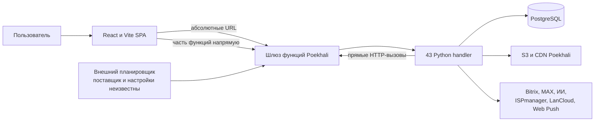
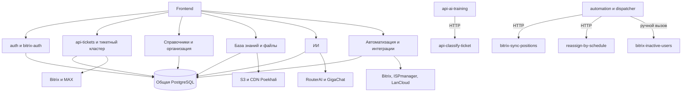
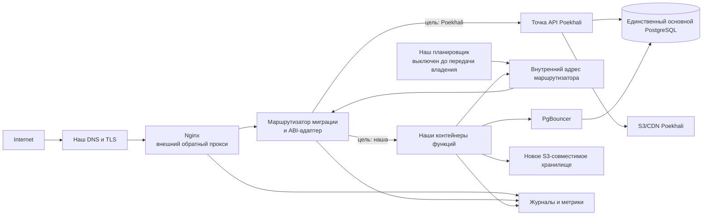
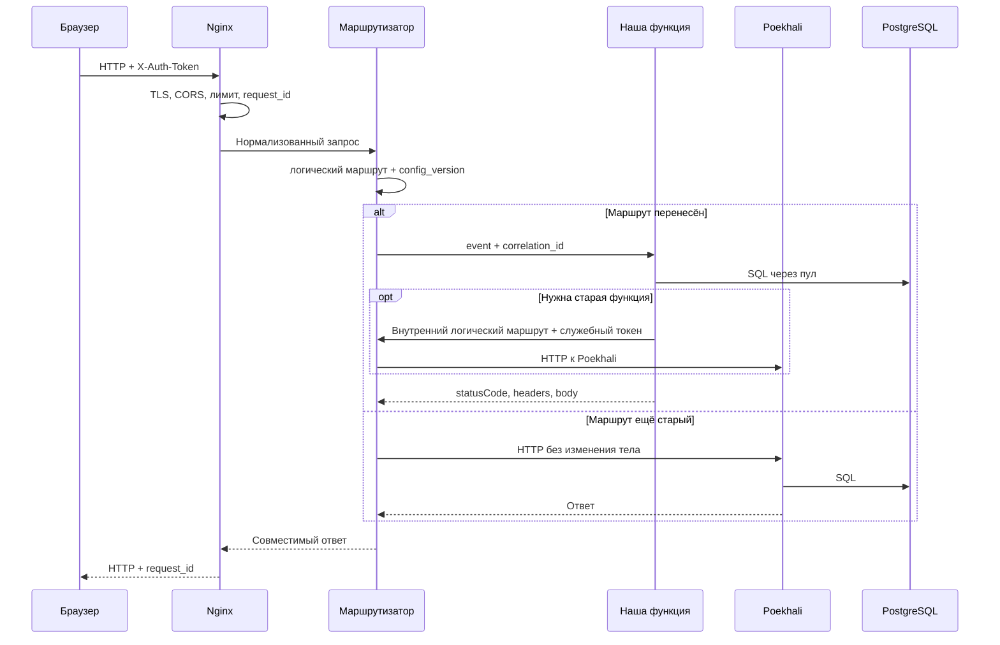
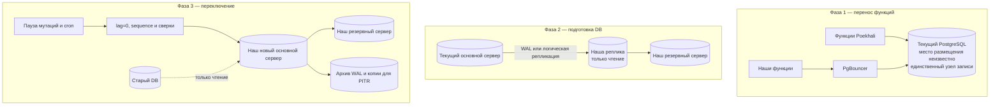
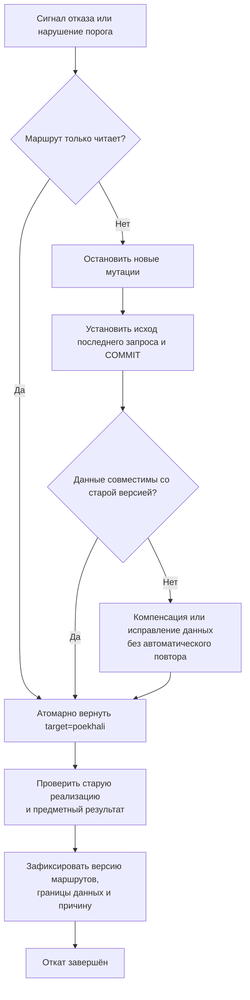
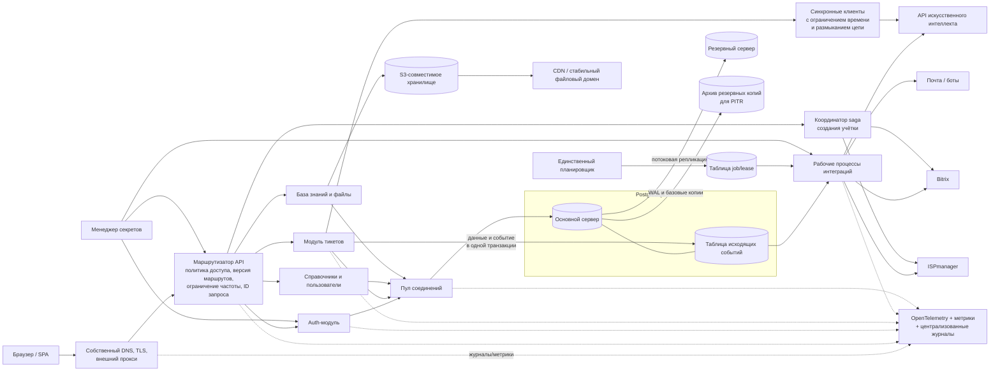

# Архитектурный аудит Helpdesk и план постепенной миграции с Poekhali

**Дата:** 2026-08-30  
**Снимок репозитория:** `e066f9fe2f63f226d82ca9adcc4c95049ad012cd`  
**Объект анализа:** текущий репозиторий, архитектурные документы и сводки `audit/notes/`. Сырые отчёты открывались только точечно для проверки спорного результата Gitleaks.  
**Недоступно:** рабочая DB, панель Poekhali, хранилище, журналы, фактические переменные среды, сетевые правила, нагрузка и реальные расписания. Такие сведения помечены `[UNKNOWN]`.

Метки достоверности:

- `[CONFIRMED]` — непосредственно подтверждено исходниками или структурой репозитория;
- `[INFERRED]` — сильный архитектурный вывод из нескольких подтверждённых фактов;
- `[UNKNOWN]` — репозиторий не даёт ответа, требуется проверка рабочей среды;
- `[RISK]` — риск, существенный для миграции или одновременной работы двух инфраструктур;
- `[RECOMMENDATION]` — рекомендуемое целевое решение.

Этот документ проектирует переходный период. Он не утверждает, что локальные `tests.json` проходят, что код этого коммита развёрнут в рабочей среде или что настройки Poekhali соответствуют репозиторию.

# 01. Краткое резюме

## Решение

`[RECOMMENDATION]` Выбрать **гибридную постепенную миграцию**:

1. поставить на нашей инфраструктуре стабильный внешний обратный прокси;
2. за ним разместить небольшой слой маршрутизации и совместимости с `handler(event, context)`;
3. один раз перевести frontend с абсолютных URL Poekhali на подконтрольный адрес;
4. переносить функции и затем домены по таблице маршрутов;
5. во время переноса вычислений оставить **один основной PostgreSQL, принимающий запись**, источником истины;
6. перенести DB отдельным переключением через однонаправленную репликацию или остановку записей и восстановление;
7. после снятия зависимости от Poekhali постепенно разделить `api-tickets`, автоматизацию и интеграционные координаторы.

Полное переписывание сейчас не нужно. В backend нет закрытого SDK Poekhali: обработчики используют Python, `psycopg2`, обычный HTTP и совместимый с S3 клиент. Однако запуск «как есть» невозможен без HTTP-адаптера, маршрутизации, контейнеров, секретов, наблюдаемости, планировщика и стратегии DB/файлов (`backend/shared_utils.py:26-52`, `backend/api-tickets/index.py:1570-1604`, `backend/upload-file/index.py:56-66`).

## Ответы, влияющие на решение

- `[INFERRED]` По форме кода это **распределённый монолит**: 43 отдельные единицы запуска разделяют DB, JWT, таблицы и доменные правила, а несколько функций ещё и вызывают другие функции по HTTP.
- `[CONFIRMED]` В реестре 43 функции, и у всех есть локальный `index.py` с `handler(event, context)` (`backend/func2url.json:2-44`). Точная развёрнутая версия каждой функции `[UNKNOWN]`.
- `[CONFIRMED]` Объединение адресов из реестра и исходников даёт 54 уникальных URL `functions.poehali.dev`. Для 11 адресов вне реестра нет подтверждённого соответствия зарегистрированному локальному обработчику; доступность и активность этих адресов `[UNKNOWN]`.
- `[RECOMMENDATION]` Полноценный промышленный API Gateway перед первой функцией не требуется. Достаточно отказоустойчивого Nginx и небольшого маршрутизатора совместимости; управляемый шлюз имеет смысл позже при появлении требований к внешним клиентам, тарифам, ключам и сложным политикам.
- `[UNKNOWN]` Новая функция сможет работать с текущей рабочей PostgreSQL только при безопасном сетевом подключении с нашей стороны. Код это допускает, но репозиторий не доказывает ни место размещения DB, ни эксплуатационные настройки (`backend/shared_utils.py:12-23`, `backend/shared_utils.py:42-52`).
- `[RECOMMENDATION]` Первая рабочая функция — `users-search`: только GET, одна основная таблица, JWT, нет внешних API и безопасный откат (`backend/users-search/index.py:9-70`). Перед переключением её SQL следует параметризовать (`backend/users-search/index.py:34-56`).
- `[RISK]` Нельзя одновременно включать старый и новый планировщики. Диспетчер не захватывает задание атомарно; два экземпляра могут выполнить его дважды (`backend/automation-dispatcher/index.py:76-140`, `backend/automation-dispatcher/index.py:207-225`).
- `[RISK]` В коде есть блокирующие проблемы безопасности: зарегистрированный в локальном реестре сброс пароля администратора без аутентификации, предсказуемый запасной JWT-секрет и несколько чувствительных операций без локальной проверки JWT (`backend/reset-password/index.py:12-65`, `backend/auth/jwt_service.py:11-35`, `backend/create-employee-account/index.py:1537-1602`). Развёрнутая версия, доступность URL и защита шлюза Poekhali `[UNKNOWN]`.

## Пять наиболее опасных рисков

1. двойное выполнение планировщика, повторные изменения DB и внешние действия;
2. недоступность или высокая задержка PostgreSQL между инфраструктурами, исчерпание соединений и неопределённый результат `COMMIT` при обрыве сети;
3. неполный охват маршрутов из-за абсолютных URL frontend и 11 адресов без подтверждённого соответствия исходникам;
4. неравномерная аутентификация, общий JWT-секрет и отсутствие отдельной служебной аутентификации;
5. необратимые или трудно компенсируемые действия Bitrix, почты, ботов и хранилища при тайм-ауте и повторе.

# 02. Текущая архитектура

## 2.1 Компоненты

| Компонент | Статус и фактическое устройство | Доказательства |
|---|---|---|
| Frontend | `[CONFIRMED]` React 18 + TypeScript + Vite, одностраничное приложение с `BrowserRouter`; в `App` объявлено 40 маршрутов. | `package.json:6-11`, `package.json:36`, `package.json:61-65`, `src/App.tsx:60-120` |
| Клиентский API-слой | `[CONFIRMED]` Часть адресов собрана в `ENDPOINT_MAP`, но прямые абсолютные URL остаются в страницах, хуках и сервисах. Клиент добавляет `X-Auth-Token` и повторяет только GET/HEAD. | `src/utils/api.ts:1-85`, `src/utils/api.ts:184-263`, `src/services/bulkTicketsService.ts:6` |
| Backend | `[CONFIRMED]` 43 каталога функций на Python; каждый экспортирует бессерверную точку входа `handler(event, context)`. Собственного HTTP-процесса нет. | `backend/func2url.json:2-44`, `backend/auth/index.py:19-85`, `backend/api-tickets/index.py:1570-1604` |
| Договор HTTP | `[CONFIRMED]` Обработчики ожидают `httpMethod`, `headers`, `queryStringParameters`, строку `body`; возвращают `statusCode`, `headers`, строку `body` и иногда `isBase64Encoded`. | `backend/shared_utils.py:26-39`, `backend/shared_utils.py:55-98` |
| Аутентификация | `[CONFIRMED]` HS256 JWT в `X-Auth-Token`; основной токен содержит `user_id`, `username`, `exp` на семь дней. Токен хранится в `localStorage` или `sessionStorage`. Есть отдельный Bitrix OAuth. | `backend/auth/jwt_service.py:11-35`, `src/contexts/AuthContext.tsx:68-95`, `backend/bitrix-auth/index.py:25-143` |
| DB | `[CONFIRMED]` PostgreSQL через прямой `psycopg2`; типовой модуль задаёт `search_path=<MAIN_DB_SCHEMA>,public`. Общего пула в коде нет. | `backend/shared_utils.py:42-52`, `backend/auth/database_service.py:11-17` |
| Миграции DB | `[CONFIRMED]` 265 прямых файлов `V0001`–`V0265`, один отдельный `down` для V0259 и один ручной скрипт восстановления иерархии; исполнитель миграций и надёжный журнал применения не найдены. В истории есть разовые исправления конкретных рабочих данных. | `db_migrations/V0001__create_payments_table.sql`, `db_migrations/V0265__notifications_rule_id.sql`, `db_migrations/down/V0259__access_blocking_checklist_down.sql:1-25`, `db_migrations/backup_departments_before_V0210.sql:1-21` |
| Файлы | `[CONFIRMED]` `upload-file` обращается к S3-совместимому адресу Poekhali и формирует абсолютный CDN URL, который затем сохраняется в предметных данных. | `backend/upload-file/index.py:56-66`, `backend/upload-file/index.py:95-163`, `src/hooks/useFileUploader.ts:47-98` |
| Фоновые задачи | `[CONFIRMED]` `automation-dispatcher` спроектирован для внешнего периодического HTTP-вызова раз в минуту и затем вызывает другие функции по жёстким URL. `[UNKNOWN]` Кто, где и по какому фактическому расписанию вызывает его в рабочей среде. | `backend/automation-dispatcher/index.py:1-15`, `backend/automation-dispatcher/index.py:196-225` |
| Интеграции | `[CONFIRMED]` Bitrix24, MAX, RouterAI, GigaChat, ISPmanager, LanCloud, Web Push, S3/CDN. | `backend/bitrix-auth/index.py:146-215`, `backend/api-ticket-comments/index.py:682-708`, `backend/create-employee-account/index.py:245-382`, `backend/push-notifications/index.py:1-13` |
| Развёртывание | `[CONFIRMED]` В репозитории приложения нет Dockerfile, CI/CD, IaC, манифеста бессерверного развёртывания и собственного планировщика. | `package.json:6-11`, `vite.config.ts:22-43`; подтверждено инвентаризацией файлов этого коммита |

## 2.2 Общая схема



`[INFERRED]` Домен `functions.poehali.dev` и реестр показывают намерение запускать функции на Poekhali. Репозиторий не доказывает, какие версии реально опубликованы и получают трафик.

## 2.3 Группы функций

| Домен | Функции | Количество |
|---|---|---:|
| Тикеты и справочники | `api-tickets`, комментарии, история, массовые операции, счётчики, отметка прочтения, правила наблюдения, услуги, связи/группы полей, группы/назначения исполнителей, графики, шаблоны ответов | 14 |
| Идентификация и организация | `auth`, `bitrix-auth`, `api-general`, `users-search`, companies, departments, positions, department-positions, `reset-password` | 9 |
| Хранилище, база знаний и ИИ | `upload-file`, `api-knowledge-base`, `api-ai-training`, `api-classify-ticket`, `api-improve-comment` | 5 |
| Автоматизация | `automation`, диспетчер, переназначение, автозакрытие, проверка просрочки, платежи по расписанию | 6 |
| Bitrix и учётные записи | три синхронизации, inactive-users, notify, create-employee-account | 6 |
| Push и журналы | `push-notifications`, `collect-logs`, `log-analyzer` | 3 |

## 2.4 Фактические сквозные пути

- Вход: форма → `auth?endpoint=login` → PostgreSQL → проверка пароля → JWT → браузерное хранилище (`backend/auth/index.py:35-51`, `backend/auth/auth_service.py:16-91`).
- Список/карточка тикета: frontend собирает начальные справочники и `tickets-full`; `api-tickets` маршрутизирует 28 логических ветвей и читает общий граф таблиц (`src/hooks/useTicketsData.ts:93-173`, `backend/api-tickets/index.py:1606-1664`, `backend/api-tickets/index.py:4632-4803`).
- Создание тикета: браузер может вызвать классификацию и загрузку файла, затем `POST tickets`; backend выполняет проверку полей, назначение, SLA, несколько записей DB и уведомления (`src/hooks/useTicketForm.ts:42-150`, `backend/api-tickets/index.py:2330-2619`).
- Комментарий: DB-изменения фиксируются, после чего синхронно отправляются сообщения Bitrix/MAX (`backend/api-ticket-comments/index.py:506-711`).
- Автоматизация: диспетчер читает `automation_jobs`, создаёт `automation_runs`, вызывает функцию по HTTP и только затем сдвигает `next_run_at` (`backend/automation-dispatcher/index.py:76-140`, `backend/automation-dispatcher/index.py:207-225`).
- Создание учётной записи: один обработчик координирует почту, Bitrix и настройки; общей транзакции или журнала компенсаций между поставщиками нет (`backend/create-employee-account/index.py:245-382`, `backend/create-employee-account/index.py:1537-1602`).

## 2.5 Роль frontend в текущей архитектуре

`[CONFIRMED]` Frontend не только отображает данные: он знает физическую топологию API, добавляет JWT, кеширует ответы, делает повторы и координирует составные действия (`src/utils/api.ts:1-85`, `src/utils/api.ts:134-263`, `src/hooks/useTicketForm.ts:69-150`). Часть правил доступа и допустимых действий реализована только в интерфейсе, тогда как некоторые backend-ветви проверяют лишь JWT. Это делает прямой вызов API значимым сценарием угрозы, а шлюз не должен считать frontend доверенной стороной.

Подробный разбор границы ответственности находится в `audit/architecture/project-map.md:392` и `audit/architecture/diagrams.md:156`.

# 03. Подтверждено, выведено и неизвестно

| Утверждение из задания | Вердикт | Основание |
|---|---|---|
| Frontend — React/Vite SPA | `[CONFIRMED]` | `package.json:6-11`, `package.json:61-65`, `src/App.tsx:60-120` |
| Backend состоит из Python-функций с бессерверным ABI | `[CONFIRMED]` | 43 `handler(event, context)`, например `backend/users-search/index.py:9`, `backend/api-tickets/index.py:1570` |
| Эти функции сейчас выполняются на Poekhali | `[INFERRED]` | Адреса `functions.poehali.dev` в `backend/func2url.json:2-44`; рабочая панель недоступна |
| Реестр соответствует точкам API Poekhali | `[CONFIRMED]` как конфигурация репозитория; `[UNKNOWN]` как рабочее развёртывание | `backend/func2url.json:2-44` |
| `backend/<function>/index.py` — исходник соответствующей зарегистрированной функции | `[CONFIRMED]` структурно для всех 43; точное совпадение опубликованной версии `[UNKNOWN]` | имя каталога, запись реестра и локальный `handler` совпадают |
| Функции используют PostgreSQL | `[CONFIRMED]` для 41 из 43; исключения — `upload-file` и `api-improve-comment` | `backend/shared_utils.py:42-52`, `backend/upload-file/index.py:56-69`, `backend/api-improve-comment/index.py:1-7` |
| Несколько функций работают с общей DB/схемой | `[INFERRED]` очень высокой уверенности; значения среды `[UNKNOWN]` | общий `DATABASE_URL`, `MAIN_DB_SCHEMA` и одни таблицы; `backend/shared_utils.py:12-23` |
| Есть прямые вызовы функция → функция | `[CONFIRMED]` | `backend/api-ai-training/index.py:10-12`, `backend/automation/index.py:11-16`, `backend/automation-dispatcher/index.py:11-15` |
| Frontend обращается прямо к функциям | `[CONFIRMED]` | `src/utils/api.ts:1-18`, `src/pages/Login.tsx:11-46`, `src/services/bulkTicketsService.ts:6` |
| Существует общий JWT-договор | `[CONFIRMED]`, но реализации скопированы и расходятся | `backend/auth/jwt_service.py:11-35`, `backend/shared_utils.py:55-72` |
| `api-tickets` — логический центр | `[CONFIRMED]` | 28 ветвей `backend/api-tickets/index.py:1606-1664`; основной CRUD `backend/api-tickets/index.py:1805-3256` |
| `create-employee-account` — интеграционный узел | `[CONFIRMED]` | `backend/create-employee-account/index.py:245-382`, `backend/create-employee-account/index.py:1537-1602` |
| Dispatcher вызывает другие функции | `[CONFIRMED]` | `backend/automation-dispatcher/index.py:143-193` |
| Система — распределённый монолит | `[INFERRED]` | раздельные обработчики, общая DB/JWT, прямые HTTP-адреса и распределённые правила |

## Главные неизвестные рабочей среды

`[UNKNOWN]` Требуют проверки до утверждения архитектуры переключения:

1. какие URL реально получают трафик и какой коммит развёрнут;
2. точный договор события Poekhali, пределы тела, времени, памяти и параллелизма;
3. сетевой доступ к PostgreSQL, TLS, разрешённые IP, регион и лимиты соединений;
4. версия PostgreSQL, расширения, роли, `search_path`, часовой пояс, RLS, триггеры и ручной дрейф схемы;
5. размеры DB и хранилища, частота записи, RPO/RTO и допустимое окно остановки;
6. реальные cron, часовой пояс, повторы и политика параллельных запусков;
7. защита точек API на шлюзе Poekhali, внешние списки разрешённых IP и ограничения частоты;
8. полный набор переменных и секретов каждой функции;
9. активные возвратные адреса OAuth, веб-хуки и адреса ботов;
10. фактическая задержка, ошибки, трассировки и прохождение тестов.

# 04. Граф зависимостей

## 4.1 Крупные узлы



`[CONFIRMED]` Явного цикла среди межфункциональных HTTP-вызовов нет. Циклы логические: состояние тикета → правило/задание → изменение тикета → история/уведомление; Bitrix → локальная оргструктура → действия пользователя → уведомление обратно в Bitrix.

## 4.2 Полный реестр функций

В колонке «самостоятельность» оценивается возможность переключить физическую функцию отдельно при сохранении одной общей DB. Это не означает независимость предметного домена. Для всех 43 точек входа отдельная карта входа, следующих вызовов и прикладной защиты находится в `audit/architecture/project-map.md:196-245`, а связь сущностей, таблиц и модулей — в `audit/architecture/project-map.md:564-583`.

Для малых функций ниже не разделены каждая читаемая и изменяемая таблица и не повторён полный список env: это необходимо уточнить перед переносом конкретной функции по её SQL/ветвям. Здесь такие поля считаются **не детализированными**, а не отсутствующими. Архитектурно значимые исключения и критичные группы разобраны в разделе 4.2.1.

### Идентификация и организация — 9

| Функция и точка входа | Кто вызывает | Данные / внешние системы | Самостоятельность |
|---|---|---|---|
| `auth` — `backend/auth/index.py:19` | Frontend | пользователи, роли, права, уведомления, JWT | Низкая: системный вход, не первая |
| `bitrix-auth` — `backend/bitrix-auth/index.py:25` | Frontend и возвратный адрес OAuth | Bitrix OAuth/REST, пользователи, JWT | Низкая: переносить после проверки JWT/возвратного адреса |
| `api-general` — `backend/api-general/index.py:17` | Frontend | 10 ресурсов пользователей, прав и справочников | Средняя, лучше делить по логическим маршрутам |
| `users-search` — `backend/users-search/index.py:9` | Подсказки упоминаний | пользователи | Высокая; лучший первый кандидат |
| `companies` — `backend/companies/index.py:14` | Frontend | компании | Средняя; сначала добавить единый доступ |
| `departments` — `backend/departments/index.py:239` | Frontend, оргструктура | подразделения, должности, пользователи | Средняя |
| `positions` — `backend/positions/index.py:14` | Frontend | должности | Средняя; локальной проверки JWT нет |
| `department-positions` — `backend/department-positions/index.py:19` | Frontend | связи подразделений и должностей | Высокая после добавления доступа |
| `reset-password` — `backend/reset-password/index.py:12` | Источник вызова `[UNKNOWN]` | пользователи | Не переносить; отключить и удалить |

### Тикетный кластер — 14

| Функция и точка входа | Кто вызывает | Данные / внешние системы | Самостоятельность |
|---|---|---|---|
| `api-tickets` — `backend/api-tickets/index.py:1570` | Большая часть frontend | тикеты, SLA, назначения, согласования, уведомления, Bitrix/MAX | Очень низкая; центральная группа |
| `api-bulk-tickets` — `backend/api-bulk-tickets/index.py:124` | Сервис массовых действий | тикеты и связанные таблицы, Bitrix | Низкая; сначала исправить права и доменные правила |
| `api-ticket-comments` — `backend/api-ticket-comments/index.py:178` | Карточка тикета | комментарии, вложения, история, уведомления, Bitrix/MAX | Низкая/средняя |
| `api-ticket-history` — `backend/api-ticket-history/index.py:27` | Карточка тикета | тикеты, история, пользователи | Высокая технически; сначала объектное право доступа |
| `tickets-counters` — `backend/tickets-counters/index.py:10` | Шапка и списки | уведомления, тикеты, наблюдатели, согласующие | Средняя; только чтение, но заметная нагрузка |
| `tickets-mark-read` — `backend/tickets-mark-read/index.py:12` | Frontend | просмотры, уведомления | Средняя; идемпотентные записи частично есть |
| `api-watcher-rules` — `backend/api-watcher-rules/index.py:22` | Настройки и правила | правила, тикеты, наблюдатели, Bitrix/MAX | Низкая из-за массовых побочных действий |
| `api-services` — `backend/api-services/index.py:9` | Frontend | услуги | Средняя |
| `api-service-field-mappings` — `backend/api-service-field-mappings/index.py:9` | Frontend | услуги, дополнительные поля | Средняя |
| `api-field-groups` — `backend/api-field-groups/index.py:9` | Frontend | группы и поля | Средняя; доступ неравномерен |
| `api-executor-groups` — `backend/api-executor-groups/index.py:9` | Frontend и ядро через DB | группы, участники, услуги | Средняя, в группе назначения |
| `api-executor-assignments` — `backend/api-executor-assignments/index.py:12` | Frontend и ядро через DB | назначения, пользователи, группы | Средняя, в группе назначения |
| `api-work-schedules` — `backend/api-work-schedules/index.py:6` | Frontend и переназначение через DB | графики работы | Средняя, в группе назначения |
| `api-reply-templates` — `backend/api-reply-templates/index.py:22` | Редактор комментария | шаблоны ответов, пользователи | Высокая/средняя; хороший ранний кандидат |

### Хранилище и ИИ — 5

| Функция и точка входа | Кто вызывает | Данные / внешние системы | Самостоятельность |
|---|---|---|---|
| `upload-file` — `backend/upload-file/index.py:69` | Формы, комментарии, аватары | S3/CDN Poekhali, без DB | Код отделим, данные и URL — нет |
| `api-knowledge-base` — `backend/api-knowledge-base/index.py:621` | Раздел базы знаний | KB-таблицы, S3/CDN | Низкая; переносить с файлами и старыми URL |
| `api-ai-training` — `backend/api-ai-training/index.py:89` | Административный frontend | таблицы ИИ, GigaChat, HTTP к классификатору | Низкая относительно классификатора |
| `api-classify-ticket` — `backend/api-classify-ticket/index.py:743` | Форма тикета и обучение | каталоги/таблицы ИИ, RouterAI, GigaChat | Средняя; сначала аутентификация/TLS/служебный договор |
| `api-improve-comment` — `backend/api-improve-comment/index.py:72` | Редактор комментария | GigaChat, без DB | Высокая технически, но не рабочий первый кандидат до аутентификации/TLS |

### Автоматизация — 6

| Функция и точка входа | Кто вызывает | Данные / внешние системы | Самостоятельность |
|---|---|---|---|
| `automation` — `backend/automation/index.py:355` | Административный frontend | automation_jobs/runs, HTTP к трём функциям | Низкая; единый контур запуска |
| `automation-dispatcher` — `backend/automation-dispatcher/index.py:196` | Внешний cron `[UNKNOWN]` | automation_jobs/runs, HTTP | Не включать параллельно |
| `reassign-by-schedule` — `backend/reassign-by-schedule/index.py:30` | Dispatcher/cron | tickets, schedules, history | Низкая до блокировок и идемпотентности |
| `ticket-auto-close` — `backend/ticket-auto-close/index.py:15` | Cron `[UNKNOWN]` | tickets, statuses, history | Низкая до защиты от двойного запуска |
| `tickets-overdue-checker` — `backend/tickets-overdue-checker/index.py:15` | Cron `[UNKNOWN]` | tickets, notifications | Низкая до уникальности уведомлений |
| `process-scheduled-payments` — `backend/process-scheduled-payments/index.py:150` | Cron `[UNKNOWN]` | старая схема платежей | Сначала подтвердить использование; высокий риск дублей |

### Bitrix и учётные записи — 6

| Функция и точка входа | Кто вызывает | Данные / внешние системы | Самостоятельность |
|---|---|---|---|
| `bitrix-sync-departments` — `backend/bitrix-sync-departments/index.py:563` | Frontend/cron | Bitrix, departments, positions, users | Поздняя интеграционная группа |
| `bitrix-sync-heads` — `backend/bitrix-sync-heads/index.py:270` | Frontend/cron | Bitrix, departments, users | Поздняя группа |
| `bitrix-sync-positions` — `backend/bitrix-sync-positions/index.py:266` | Frontend, automation | Bitrix, positions, users | Поздняя группа |
| `bitrix-inactive-users` — `backend/bitrix-inactive-users/index.py:589` | Frontend, automation | Bitrix, ISPmanager, users, отчёты | Не ранняя: внешняя деактивация |
| `bitrix-notify` — `backend/bitrix-notify/index.py:21` | Источник события `[UNKNOWN]` | PostgreSQL, веб-хук Bitrix | Сначала установить реальный вызывающий контур |
| `create-employee-account` — `backend/create-employee-account/index.py:1537` | Frontend/действие тикета | Bitrix, ISPmanager, LanCloud, RouterAI, настройки DB | Одна из последних; нужна saga |

### Push и журналы — 3

| Функция и точка входа | Кто вызывает | Данные / внешние системы | Самостоятельность |
|---|---|---|---|
| `push-notifications` — `backend/push-notifications/index.py:13` | Frontend под другим URL | старая схема, Web Push | Сначала подтвердить адрес, фоновый обработчик браузера и схему |
| `collect-logs` — `backend/collect-logs/index.py:11` | UI под другим URL/cron `[UNKNOWN]` | log_*; сейчас демонстрационные записи | Лучше заменить наблюдаемостью |
| `log-analyzer` — `backend/log-analyzer/index.py:10` | Активный маршрут UI под другим URL | log_* | Не переносить до подтверждения ценности и адреса |

### 4.2.1 Детализация критичных групп

Полные таблицы и колонки для всех 43 функций не перечисляются: это быстро устареет и не изменит порядок миграции. Ниже выделены зависимости, которые определяют границу переноса; оставшиеся малые CRUD-функции используют общий набор `DATABASE_URL`, `MAIN_DB_SCHEMA`, `JWT_SECRET` и соответствующие предметные таблицы.

| Группа | Основное чтение | Основная запись | Вызовы и внешние системы | Auth/env | Критичность переноса |
|---|---|---|---|---|---|
| `auth` / `bitrix-auth` | пользователи, роли, права, уведомления, данные OAuth | вход/профиль пользователя и связанные данные авторизации | Bitrix OAuth/REST | `DATABASE_URL`, `MAIN_DB_SCHEMA`, `JWT_SECRET`, `BITRIX24_*`; пользовательский вход/OAuth (`backend/auth/index.py:19-85`, `backend/bitrix-auth/index.py:44-76`) | Критическая: общий вход и выпуск JWT |
| `api-tickets` | tickets, статусы, SLA, услуги, поля, исполнители, согласования, наблюдатели | тикет, значения полей, история, назначения, уведомления | локальные модули SLA/назначения, Bitrix/MAX | общий JWT/DB; объектные проверки распределены (`backend/api-tickets/index.py:1805-2328`, `backend/api-tickets/index.py:2330-3256`) | Критическая, очень низкая независимость |
| Комментарии/история/массовые операции | тикеты, комментарии, вложения, история, права и получатели | комментарии, история, уведомления, массовые изменения/удаления | Bitrix/MAX после фиксации DB | общий JWT/DB; объектный доступ непоследователен (`backend/api-ticket-comments/index.py:357-503`, `backend/api-ticket-comments/index.py:673-708`, `backend/api-bulk-tickets/index.py:109-248`) | Высокая: частичные и массовые эффекты |
| Автоматизация | задания/запуски, тикеты, графики, уведомления, платежи | запуски, сроки, назначения, статусы, платежи и уведомления | прямой HTTP к синхронизации/переназначению; внешние cron `[UNKNOWN]` | DB; служебной аутентификации нет (`backend/automation-dispatcher/index.py:76-193`) | Критическая: должен быть один владелец |
| Создание учётки / Bitrix | users/departments/integration_settings и внешние каталоги | локальные настройки/состояние и удалённые учётки | Bitrix, ISPmanager, LanCloud, RouterAI, почтовые панели | `INTEGRATION_ENCRYPTION_KEY`, `BITRIX24_*`, `ISPMGR_*`, `ROUTERAI_API_KEY`, почтовые env (`backend/create-employee-account/index.py:164-188`, `backend/create-employee-account/index.py:245-382`) | Критическая: частично необратимые действия |
| База знаний / файлы | KB-таблицы, метаданные файлов | статьи, связи и S3-объекты | S3/CDN Poekhali | JWT/DB для KB, `AWS_ACCESS_KEY_ID`, `AWS_SECRET_ACCESS_KEY` для загрузки (`backend/api-knowledge-base/index.py:19-54`, `backend/api-knowledge-base/index.py:439-475`, `backend/api-knowledge-base/index.py:621-666`, `backend/upload-file/index.py:56-66`) | Высокая: исторические URL являются данными |
| ИИ | правила/примеры/журналы ИИ и каталоги тикетов | обучение, журналы классификации, проверки | GigaChat, RouterAI; `api-ai-training` → `api-classify-ticket` | `GIGACHAT_AUTH_KEY`, `ROUTERAI_API_KEY`, `USE_EMBEDDINGS`, `CLASSIFY_URL`; локальная аутентификация неравномерна (`backend/api-classify-ticket/index.py:13-72`, `backend/api-ai-training/index.py:10-12`) | Средняя/высокая после исправления TLS/аутентификации |
| Малые справочники | одна или несколько организационных/настроечных таблиц | GET либо локальный CRUD | обычно нет внешнего API | общий JWT/DB, но есть исключения без JWT | Низкая/средняя; ранняя группа после нормализации доступа |

`[CONFIRMED]` 41 из 43 обработчиков использует PostgreSQL. `[INFERRED]` Поэтому связь через общую DB сильнее редких HTTP-рёбер: схема и предметные таблицы фактически служат скрытой шиной между физически отдельными функциями.

## 4.3 Межфункциональные HTTP-рёбра

`[CONFIRMED]` В backend найдены только следующие прямые адреса функций:

- `api-ai-training → api-classify-ticket`; адрес настраивается через `CLASSIFY_URL`, но запасное значение — Poekhali; служебного токена нет (`backend/api-ai-training/index.py:10-12`, `backend/api-ai-training/index.py:214-226`);
- `automation → bitrix-sync-positions / bitrix-inactive-users / reassign-by-schedule` (`backend/automation/index.py:11-16`, `backend/automation/index.py:284-350`);
- `automation-dispatcher → bitrix-sync-positions / reassign-by-schedule`; для автоматической ветви inactive-users код возвращает ошибку из-за отсутствия admin-токена (`backend/automation-dispatcher/index.py:143-193`).

Другие связи идут главным образом через общие таблицы. `api-tickets` не вызывает отдельные API SLA или исполнителей: он импортирует локальные модули и читает те же таблицы (`backend/api-tickets/index.py:171-181`, `backend/api-tickets/index.py:1606-1664`).

## 4.4 URL вне реестра

`[CONFIRMED]` В реестре 43 URL. В исходниках `.py/.ts/.tsx` встречаются дополнительные адреса; объединённый набор содержит 54 уникальных URL. Одиннадцать адресов отсутствуют в `func2url.json`:

| Группа | Адрес/использование | Вывод |
|---|---|---|
| Без однозначного аналога | `20167b17…` (`src/pages/CategoryPayments.tsx:65`), `42303a3a…` (`src/utils/api.ts:63`), `465f29bc…` (`src/components/payments/PaymentForm.tsx:350`) | Соответствующий локальный обработчик не установлен; часть страниц не входит в активный маршрут |
| Без однозначного аналога | `5977014b…` (`src/components/dashboard2/Dashboard2EditableLayout.tsx:64`), `8f2170d4…` (`src/pages/Contractors.tsx:92`), `a0000b1e…` (`src/pages/PlannedPayments.tsx:68`), `b79dfca0…` (`src/components/payments/ApprovedPaymentDetailsModal.tsx:68`) | Вероятно старый код, но рабочая достижимость `[UNKNOWN]` |
| Похожая локальная функция, другой URL | `acbb6915…` collect logs и `dd221a88…` log analyzer (`src/pages/LogAnalyzer.tsx:34-35`) | Активный экран использует адреса не из реестра; соответствие исходнику `[UNKNOWN]` |
| Похожая локальная функция, другой URL | `cc67e884…` push (`src/components/notifications/PushNotificationPrompt.tsx:43`) | Компонент подключён глобально; соответствие исходнику `[UNKNOWN]` |
| Похожая локальная функция, другой URL | `eeefc720…` scheduled payments (`src/components/settings/ScheduledPaymentsSettings.tsx:18`) | Компонент, вероятно, неактивен; требует проверки |

`[RISK]` Корректная формулировка — не «у 11 функций нет исходников», а «для 11 адресов, встречающихся в исходниках, нет доказанного соответствия зарегистрированному локальному обработчику». Сам репозиторий не доказывает, что адреса опубликованы и активны. Poekhali нельзя отключать, пока их активность и контракт не установлены.

## 4.5 Естественные группы миграции

1. `users-search` как пробный рабочий маршрут;
2. небольшие функции чтения и локальные справочники;
3. шаблоны, счётчики и отметка прочтения;
4. услуги, поля, группы исполнителей и графики;
5. `api-ai-training + api-classify-ticket`, отдельно `api-improve-comment` после исправлений;
6. `upload-file + файлы базы знаний + совместимость старых CDN URL`;
7. тикетный кластер: `api-tickets`, комментарии, история, массовые операции, правила наблюдателей, счётчики, отметка прочтения;
8. `auth + bitrix-auth` после проверки полного JWT/OAuth-договора;
9. синхронизации Bitrix, учётные записи и автоматизация — последними;
10. старые платежи, push и журналы — только после подтверждения рабочего использования.

# 05. Риски миграции

## 5.1 Архитектурные риски

| Приоритет | Риск | Подтверждение | Практическая защита |
|---|---|---|---|
| BLOCKER | Новый шлюз не перехватит уже встроенные абсолютные адреса Poekhali | `src/utils/api.ts:1-18`, `src/pages/Login.tsx:11`, `src/services/bulkTicketsService.ts:6` | Предварительный выпуск frontend с единым подконтрольным `API_BASE`; шлюз поддерживает старые логические формы запросов |
| BLOCKER | Для 11 URL вне реестра неизвестен точный исходник/контракт | раздел 4.4 | Журналы трафика, экспорт панели, контрактные снимки; не отключать Poekhali до закрытия каждого адреса |
| BLOCKER | Код не содержит собственной HTTP-среды выполнения | `backend/shared_utils.py:26-39`, `backend/api-tickets/index.py:1570-1604` | Совместимый адаптер HTTP ↔ event/response, затем постепенный переход на обычные HTTP-контроллеры |
| BLOCKER | Безопасный доступ нашей сети к текущей DB неизвестен | код принимает только DSN: `backend/shared_utils.py:42-52` | Проверка из целевой подсети; закрытый сетевой канал/VPN или TLS `verify-full` + разрешённые IP; при невозможности — перенос DB до DB-зависимой функции |
| HIGH | Рост задержки и числа соединений к удалённой DB | новое соединение на обработку: `backend/shared_utils.py:42-52`; длинный SQL-путь: `backend/api-tickets/index.py:1805-2328` | Совместное размещение, PgBouncer, бюджет соединений, ограничения времени и измерение p95/p99 |
| BLOCKER | Двойной планировщик | обычный SELECT и позднее обновление задания: `backend/automation-dispatcher/index.py:76-140`, `backend/automation-dispatcher/index.py:207-225` | Ровно один активный планировщик; затем атомарная аренда, уникальность запуска и идемпотентность задания |
| HIGH | Повтор мутации после тайм-аута создаёт дубликаты | нет общего ключа идемпотентности; DB фиксируется до ботов: `backend/api-ticket-comments/index.py:673-708` | Не повторять записи на шлюзе; ключи идемпотентности, журнал операций, транзакционная очередь исходящих событий (outbox) и компенсации (saga) |
| HIGH | Схема DB не воспроизводится простым прогоном 265 файлов | есть разовые изменения конкретных ID: `db_migrations/V0176__change_ticket_id_1323_to_9621.sql:1-13`, `db_migrations/V0247__rebalance_tickets_saidov_to_anferova.sql:1-12` | Фактический `pg_dump --schema-only` как исходная точка; отделить исторические исправления данных от новых миграций |
| HIGH | Три способа выбора схемы DB | `backend/shared_utils.py:12-23`, `backend/api-bulk-tickets/index.py:15`, `backend/push-notifications/index.py:62-68` | Явная каноническая схема, проверка `search_path`, охват обеих старых схем при копировании |
| HIGH | Старые абсолютные CDN URL являются данными | `backend/upload-file/index.py:56-66`, `src/hooks/useFileUploader.ts:87-98` | Копирование объектов, двойное чтение/перенаправление, затем проверенное переписывание URL |
| HIGH | Неравномерная аутентификация и публичные служебные операции | `backend/reset-password/index.py:12-65`, `backend/upload-file/index.py:69-92`, `backend/create-employee-account/index.py:1537-1602` | Закрыть до переключения; запрет по умолчанию на шлюзе; единый user/service auth в backend |
| HIGH | Изменение возвратных адресов, веб-хуков, IP и исходящего NAT | `src/pages/Login.tsx:38-50`, `backend/bitrix-auth/index.py:146-215` | Сохранить старый и новый возвратный адрес на период отката; заранее зарегистрировать новый адрес и исходящие IP |
| MEDIUM | Несовместимые пределы времени и вложенные повторы | frontend повторяет GET: `src/utils/api.ts:177-263`; `api-tickets` ещё раз повторяет DB GET: `backend/api-tickets/index.py:1579-1601` | Единый бюджет времени; запрет повторов записей; ограниченные повторы только доказанно безопасного чтения |
| HIGH | Нет достаточной сквозной наблюдаемости | межфункциональные вызовы не передают ID: `backend/automation-dispatcher/index.py:143-190`; журналы — разрозненный `print` | Сквозной ID, структурированные журналы, метрики по маршруту/цели и проверенный откат до первого трафика |

## 5.2 Что сохраняется и что требует переработки

Это оценка по компонентам и сложности, не точный подсчёт строк.

| Класс | Доля backend-логики | Компоненты | Решение |
|---|---:|---|---|
| A — почти без изменений | 5–10% | отдельные чистые преобразования и небольшие функции | Обернуть HTTP-адаптером и зафиксировать зависимости |
| B — адаптация | 50–60% | auth/CRUD, справочники, часть тикетного чтения, стандартные REST-интеграции | Сохранить Python/SQL; вынести URL, DB, CORS, auth и конфигурацию |
| C — существенный рефакторинг | 25–35% | `api-tickets`, comments/bulk, база знаний/хранилище, автоматизация, создание учёток | Сначала совместимый перенос, затем разделение транзакций, правил и побочных действий |
| D — удалить, заменить или переписать | 5–10% | `reset-password`, демонстрационный сборщик журналов и подтверждённый устаревший код | Не переносить автоматически |

Диапазоны относятся только к 43 локальным зарегистрированным обработчикам. Одиннадцать дополнительных URL — отдельный неизвестный объём: у четырёх есть вероятные локальные аналоги, у семи однозначного аналога нет (раздел 4.4).

`[INFERRED]` Ориентировочно 60–75% существующей backend-логики можно сохранить. Классы A+B дают 55–70%; верхняя граница предполагает сохранение предметной логики и SQL части класса C после выделения побочных действий. Уверенность средняя-низкая: нет рабочего профиля трафика, точных развёрнутых версий и фактической схемы DB.

# 06. Варианты шлюза API

## 6.1 Архитектурные варианты A–E

| Вариант | Как работает и как переносится маршрут | Откат | Плюсы | Минусы и риски | Сложность |
|---|---|---|---|---|---|
| A. Шлюз напрямую → Poekhali / наша функция | Правило внешнего шлюза сразу выбирает целевой сервис по пути | Вернуть правило на Poekhali | Мало компонентов, быстро | Сложно маршрутизировать логический `endpoint` внутри крупных функций; публичная и внутренняя маршрутизация расходятся | Низкая/средняя |
| B. Шлюз → отдельный слой миграции → две инфраструктуры | Внешний шлюз решает только сеть/TLS, внутренний маршрутизатор выбирает реализацию | Атомарно вернуть версию таблицы маршрутов | Гибкая маршрутизация по функции, `endpoint`, методу и действию; единый аудит | Ещё один процесс и сетевой переход; сам маршрутизатор становится критичным | Средняя |
| C. Шлюз заменяет точку API за точкой API | В одном шлюзе растёт таблица правил; для `api-tickets` можно учитывать параметр строки запроса `endpoint` | Вернуть конкретный логический маршрут | Хороший постепенный перенос и малый радиус ошибки | Это стратегия, а не полная архитектура; сложная конфигурация без проверок быстро становится хрупкой | Средняя |
| D. Обратный прокси перед существующими URL | Новый стабильный домен проксирует всё в Poekhali; затем правила меняются | По умолчанию всё остаётся старым | Самый быстрый первый мост | Нужен выпуск frontend; сам по себе не даёт ABI-адаптер, внутреннюю идентичность и тонкую маршрутизацию | Низкая |
| E. Внешний обратный прокси + логический маршрутизатор/адаптер + отдельный внутренний адрес | Комбинация D, B и C: стабильный вход, одна версия таблицы целей, совместимость старого ABI, отдельный внутренний трафик | Версия таблицы откатывается целиком или по маршруту | Лучший контроль, единая наблюдаемость, постепенность и отсутствие нового тяжёлого поставщика | Требует высокой доступности двух небольших компонентов и дисциплины конфигурации | Средняя |

`[RECOMMENDATION]` Выбрать **E**. Это не отдельная большая платформа: внешний прокси и маршрутизатор могут быть двумя слоями одного развёртывания, но ответственность и журналы у них должны быть разделены.

## 6.2 Nginx, Traefik, HAProxy, собственный маршрутизатор и полный шлюз

| Средство | Подходит для | Сильные стороны | Ограничение в этом проекте | Вердикт |
|---|---|---|---|---|
| Nginx | Внешний TLS, CORS, лимиты, проксирование, статические карты | Зрелый, предсказуемый, простая эксплуатация | Глубокие правила по `endpoint/action`, атомарные проценты и ABI удобнее вынести в приложение | **Рекомендуемый внешний слой** |
| Traefik | Динамическое обнаружение контейнеров/Kubernetes | Автоматическое обнаружение, удобные сертификаты | Инфраструктура оркестратора ещё не выбрана; не решает предметную таблицу маршрутов | Альтернатива при уже принятом Kubernetes |
| HAProxy | Высоконагруженная балансировка и проверки целевых сервисов | Надёжность, гибкие проверки, хорошая производительность | Более низкоуровневая конфигурация для преобразования текущего API | Хорошая альтернатива при опыте команды |
| Малый собственный маршрутизатор | Логические ключи, ABI-адаптер, версия конфигурации, сквозные ID | Точно соответствует текущему нестандартному контракту | Дополнительный код безопасности и доступности | **Нужен за внешним прокси**, держать минимальным |
| Полноценный API Gateway | Много внешних клиентов, ключи, тарифы, портал разработчика, сложные политики | Богатые политики и аналитика | Лишняя сложность/стоимость и потенциальная новая зависимость на первом этапе | Пока не нужен |

# 07. Рекомендуемая архитектура шлюза

## 7.1 Переходная топология



`[RISK]` До выпуска frontend браузер продолжит ходить прямо на `functions.poehali.dev`; новый домен не может перехватить эти запросы. Минимальный предварительный выпуск должен заменить все абсолютные адреса на один настраиваемый базовый адрес. На переходе шлюз может принимать алиасы старых UUID, чтобы не менять все логические формы запросов одновременно.

## 7.2 Таблица маршрутов

Не использовать 43 независимые переменные `FUNCTION_X_TARGET`: они не дают атомарного переключения, истории и проверки полноты. Хранить одну версионируемую декларативную таблицу в Git/CI и загружать её атомарно:

```yaml
version: 17
routes:
  users-search:
    match: { path: /api/users-search, methods: [GET, OPTIONS] }
    aliases: [/f8b49a39-1f3e-4195-9d9f-521b0cfca73d]
    state: our
    upstream: users-search.service.internal
    auth: user-jwt
    timeout_ms: 3000
    retries: 0
  tickets-read:
    match: { path: /api/api-tickets, query: { endpoint: tickets }, methods: [GET] }
    state: poekhali
    upstream: poekhali-api-tickets
    auth: user-jwt
    timeout_ms: 15000
    retries: 0
```

Алиас выше повторяет фактический путь старого URL после домена. Путь вида `/functions/<UUID>` был бы новым договором и потребовал бы отдельного изменения frontend.

Состояния должны быть шире булева признака: `poekhali`, `limited-our`, `our`, `disabled`. У записи нужны владелец, версия договора, ограничение времени, политика аутентификации, дата переключения и ссылка на проверку. Изменение проходит проверку, двухэтапное одобрение и создаёт неизменяемую запись аудита.

## 7.3 Путь запроса



## 7.4 Договор и поведение шлюза

- **Приём:** HTTPS на подконтрольном домене; логические пути и временные UUID-алиасы. Прямые адреса Poekhali необходимо закрыть ACL/секретом платформы, иначе шлюз можно обойти. Возможность закрытия `[UNKNOWN]`.
- **ABI:** адаптер формирует `httpMethod`, нормализованные заголовки, `queryStringParameters`, строку `body`, признак base64 и минимальный `context`; затем преобразует `statusCode/headers/body/isBase64Encoded` обратно. Точный договор Poekhali нужно снять контрактными пробами.
- **JWT:** на первом этапе передавать `X-Auth-Token` без повторной подписи. Шлюз может отвергать явно неверный токен, но backend остаётся авторитетным для прав и доступа к объекту.
- **Заголовки:** разрешить `Content-Type`, `Accept`, `X-Auth-Token`, `X-Request-ID`, `traceparent`; удалить внешние `X-Internal-*`, `X-User-Id` и `Forwarded`, затем выставить доверенные значения самостоятельно.
- **CORS:** отвечать централизованно только для утверждённых источников frontend. Существующее `*` (`backend/shared_utils.py:26-39`) не переносить как целевую политику.
- **Ограничения времени:** отдельные значения для короткого чтения, DB-записи, AI и длительной синхронизации. Внутренний вызов получает меньший остаточный бюджет, чем внешний запрос.
- **Повторы:** не повторять POST/PUT/DELETE. GET/HEAD повторять не более одного раза и только если маршрут доказанно не имеет побочных действий. Не складывать повторы шлюза поверх клиентских и backend-повторов без общего бюджета.
- **4xx/5xx:** 4xx возвращать вызывающему без перехода на другую реализацию. 5xx/тайм-аут записи не должны автоматически направляться в старую функцию: первая реализация могла уже изменить состояние.
- **Проверки:** `/live` — жизнеспособность процесса; `/ready` — готовность таблицы маршрутов, секретов и обязательных внутренних зависимостей. Эти адреса доступны балансировщику и мониторингу, а не всему интернету. Внешняя синтетическая проверка использует отдельный минимальный маршрут. Состояние внешних API не включается в `/live`.
- **Ограничение частоты:** отдельно для входа, ИИ, загрузки, OAuth, тяжёлых панелей и административных действий; ключ — пользователь/служба и IP, а не только IP.
- **Откат:** переключение версии таблицы маршрутов; для записи — только после проверки результата и совместимости DB, без автоматического повторного выполнения.

## 7.5 Внутренний трафик

`[RECOMMENDATION]` Вызовы backend → backend должны идти не через публичный внешний адрес, а через **внутренний адрес того же логического маршрутизатора**. Он использует ту же таблицу целей, поэтому `api-ai-training` не знает, где находится `api-classify-ticket`, а диспетчер — где находится `reassign-by-schedule`.

Отдельное обнаружение сервисов в начале не нужно: логические имена и внутренний DNS контейнерной среды достаточны. При появлении оркестратора его DNS может стать способом обнаружения, но решение о Poekhali/нашей инфраструктуре остаётся в таблице миграции.

## 7.6 Конфигурация перехода

`[CONFIRMED]` Единого полного описания конфигурации в репозитории нет. Значения рабочей среды и даже полный список фактически заданных переменных `[UNKNOWN]`; ниже перечислен договор, наблюдаемый в коде, без значений секретов.

| Группа | Наблюдаемые параметры и жёсткие значения | Что сделать |
|---|---|---|
| Маршруты функций | 43 URL в `func2url.json`, прямые URL frontend и межфункциональные `CLASSIFY_URL`/адреса автоматизации (`backend/func2url.json:2-44`, `src/utils/api.ts:1-85`, `backend/api-ai-training/index.py:10-12`, `backend/automation/index.py:11-16`) | Одна проверяемая таблица маршрутов; в коде только логические имена, без запасного URL Poekhali |
| DB | `DATABASE_URL`, местами `DSN`, `MAIN_DB_SCHEMA`; две жёсткие схемы и обращения без квалификации (`backend/shared_utils.py:12-23`, `backend/reset-password/database_service.py:9-15`, `backend/api-bulk-tickets/index.py:15`, `backend/process-scheduled-payments/index.py:12-17`) | Единая схема конфигурации, централизованная выдача DSN, явный `search_path`, проверка при запуске |
| Auth и шифрование | `JWT_SECRET`, `INTEGRATION_ENCRYPTION_KEY`; у двух auth-реализаций есть запасной JWT-секрет (`backend/auth/jwt_service.py:11-35`, `backend/bitrix-auth/index.py:11-13`, `backend/create-employee-account/index.py:164-188`) | Менеджер секретов, отсутствие запасных значений, версия/владелец/ротация и проверка расшифрования до готовности |
| Файлы | `AWS_ACCESS_KEY_ID`, `AWS_SECRET_ACCESS_KEY`, жёсткая точка S3 и CDN-шаблон (`backend/upload-file/index.py:56-66`) | Отдельные секреты и параметры `S3_ENDPOINT`, бакет, регион, файловый домен; старые URL поддерживать как данные |
| Bitrix/почта/ISPmanager/боты | `BITRIX24_*`, `BITRIX_BOT_*`, `CORP_MAIL_DOMAIN*`, `ISPMGR_*`, `MAX_BOT_TOKEN`; часть значений может браться из зашифрованной DB (`backend/bitrix-auth/index.py:44-52`, `backend/create-employee-account/index.py:164-188`, `backend/create-employee-account/index.py:269-305`) | Разделить адреса и секреты; запретить молчаливое переключение между DB и env; валидировать узлы/протоколы |
| ИИ | `GIGACHAT_AUTH_KEY`, `ROUTERAI_API_KEY`, `USE_EMBEDDINGS`, `CLASSIFY_URL` (`backend/api-classify-ticket/index.py:13-72`, `backend/api-ai-training/index.py:10-12`) | Флаг хранить в общей версии конфигурации; ключи — только в менеджере секретов; URL классификатора — логический маршрут |
| Push | `VAPID_PRIVATE_KEY`, DB и старая жёсткая схема (`backend/push-notifications/index.py:10-13`, `backend/push-notifications/index.py:62-68`, `backend/push-notifications/index.py:116-130`) | Подтвердить активный адрес/подписки, перенести VAPID как секрет без регенерации до плана повторной подписки |
| Расписания | В коде есть ожидание запуска каждую минуту и миграционные presets, но фактический cron отсутствует (`backend/automation-dispatcher/index.py:196-198`, `db_migrations/V0256__reassign_by_schedule_every_5min.sql:1-4`) | Версионируемый реестр расписаний: владелец, зона времени, единственный активный узел, ключ запуска и аварийное отключение |
| Возвратные адреса | Bitrix `redirect_uri` приходит из запроса; точные зарегистрированные URI не хранятся (`backend/bitrix-auth/index.py:44-76`) | Явный список разрешённых URI в конфигурации и синхронное изменение у внешнего поставщика |

Конфигурация маршрутов, обычные параметры и секреты — три разных слоя. Таблица маршрутов хранится в Git/CI с историей; обычная конфигурация — в валидируемом хранилище; секреты — только в менеджере секретов. Для каждого развёртывания сохраняются версия всех трёх слоёв и контрольная сумма, но не значения секретов.

# 08. Стратегия PostgreSQL

## 8.1 Можно ли оставить текущую DB на месте

`[CONFIRMED]` Код принимает обычный `DATABASE_URL` и не использует специальный клиент Poekhali (`backend/shared_utils.py:42-52`).  
`[UNKNOWN]` Репозиторий не устанавливает, размещена ли рабочая DB у Poekhali или у отдельного поставщика. Также неизвестны доступ из нашей сети, TLS, закрытая сеть, списки IP и задержка.

Условный ответ: **да, функцию можно перенести отдельно и оставить текущую рабочую DB на месте**, если выполнены все условия:

1. соединение возможно из реальной подсети назначения;
2. используется закрытый сетевой канал/VPN либо TLS `verify-full`, доверенный CA и разрешённые IP;
3. измерена задержка полного сценария, а не только `SELECT 1`;
4. есть PgBouncer/пул, ограничение числа рабочих процессов и бюджет `max_connections`;
5. заданы `connect_timeout`, `statement_timeout`, `lock_timeout`, `idle_in_transaction_session_timeout`;
6. точно воспроизведён `search_path` и используется отдельная роль с минимальными правами.

Если поставщик не разрешает такой доступ, первая DB-зависимая функция блокируется. Тогда можно испытать только функции без DB либо сначала перенести PostgreSQL согласованным переключением.

## 8.2 Переходная и конечная топология DB



Главный принцип: **в каждый момент существует только один основной сервер, принимающий запись**. Совместная работа двух наборов функций с одной DB допустима; одновременная запись приложением в две DB — нет.

## 8.3 Подключения, задержка и транзакции

- `[CONFIRMED]` Общего пула нет; соединения создаются напрямую, например `backend/automation-dispatcher/index.py:44-45`, `backend/auth/database_service.py:11-17`.
- `[RISK]` Число соединений станет суммой Poekhali и наших процессов. PgBouncer сначала безопаснее использовать в сеансовом режиме; транзакционный режим включать только после проверки `search_path`, startup `options` и подготовленных выражений.
- `[RISK]` `api-tickets` делает много последовательных SQL-запросов (`backend/api-tickets/index.py:1805-2328`), поэтому межсетевой RTT умножается на число переходов и увеличивает длительность транзакции.
- Пока обе инфраструктуры используют один основной сервер DB, локальные транзакции PostgreSQL сохраняются. Но разрыв после отправки `COMMIT` создаёт неопределённый исход: запись могла зафиксироваться, а клиент получить ошибку. Повтор записи без ключа идемпотентности запрещён.
- Добавить `application_name=helpdesk/<poekhali|our>/<function>` и наблюдать соединения, очередь пула, ожидание и взаимные блокировки, длительность транзакций и ошибки сети.

## 8.4 Способы переноса DB

| Способ | Что даёт | Ограничения | Решение |
|---|---|---|---|
| Потоковая физическая репликация | Почти точная копия кластера, малый RPO, быстрое повышение реплики | Нужны совместимые версии, базовая копия, WAL и права репликации; поддержка текущего поставщика DB `[UNKNOWN]` | Лучший путь, если официально доступен |
| Логическая репликация PostgreSQL | Выбор схем/таблиц и допустимое различие версий | DDL, роли, права и sequence не синхронизируются автоматически; нужны publication/slot | Наиболее вероятный путь при недоступности физической |
| CDC через журнал изменений | Управляемый поток с преобразованием и повторным чтением | Больше компонентов, порядок/повторы/DDL требуют отдельной логики | Только при сложном длительном переносе |
| Реплика для чтения | Теневое сравнение и прогрев | Задержка, нет мутаций, не решает переключение основного сервера | Полезный инструмент проверки, не стратегия сама по себе |
| Dump/restore с остановкой записей | Работает без прав репликации | Простой зависит от объёма и скорости проверки | Запасной путь |
| Прямая двойная запись из Python | Кажется быстрым способом держать две DB | Нет общей транзакции, расходятся ID/FK/порядок, тайм-ауты и повторы создают конфликт | **Запретить** |
| Наш основной/резервный сервер | Высокая доступность после миграции | Не переносит исходные данные | Целевая топология |

### Почему простая двойная запись опасна

Одна бизнес-операция записывает несколько связанных таблиц, ID выдаёт PostgreSQL, затем могут выполняться внешние действия. Сценарии «старая DB записала, новая упала», «тайм-аут после неизвестного commit», повтор и разные sequence нельзя склеить обычным откатом. Безопасная «двойная запись» здесь — одна запись в авторитетный основной сервер и однонаправленный WAL/логическая репликация/CDC, а не два вызова `INSERT` из обработчика.

## 8.5 Последовательность переноса DB

1. Получить фактический `pg_dump --schema-only`, роли, расширения, представления, функции, триггеры, RLS, sequence, размеры и частоту записи.
2. Зарегистрировать это состояние как исходную точку нового исполнителя миграций. Не проигрывать вслепую все `V0001`–`V0265`: среди них есть исправления конкретных рабочих данных (`db_migrations/V0211__renumber_tickets_10101_to_9757_and_10102_to_9759.sql:1-33`).
3. Создать наш основной сервер, резервный сервер, архив WAL/резервные копии и PITR; провести пробное восстановление.
4. Настроить однонаправленную физическую или логическую репликацию. Приёмник остаётся только для чтения.
5. Сверять количества, контрольные суммы по ключам, ограничения, sequence и ключевые бизнес-выборки; выполнять теневые чтения.
6. Доказать, что оставшиеся Poekhali-функции могут подключиться к новой DB, либо завершить их перенос до переключения DB.
7. Остановить cron и ручные задания, закрыть новые мутации на шлюзе, дождаться завершения запросов и нулевой приемлемой задержки репликации.
8. Синхронизировать sequence, зафиксировать LSN, повысить нашу DB, управляемо обновить DSN во всех оставшихся развёртываниях, проверить чтение и затем открыть записи. Централизован ли DSN сейчас, `[UNKNOWN]`.
9. Старую DB оставить только для чтения до конца окна наблюдения. Не включать два основных сервера записи.

После первой записи в новый основной сервер простой возврат DSN назад потеряет новые данные. Нужна заранее испытанная обратная репликация либо исправление вперёд; обратное переключение снова требует остановки записей.

## 8.6 Тихие риски схемы

- `[CONFIRMED]` Есть два жёстких vendor-имени схемы: `t_p67567221_one_file_page_projec` (`backend/api-bulk-tickets/index.py:15`) и `t_p61788166_html_to_frontend` (`backend/process-scheduled-payments/index.py:12-17`, `backend/push-notifications/index.py:62-68`). Фактическая активность `[UNKNOWN]`.
- `[CONFIRMED]` Смешаны `TIMESTAMP` и `TIMESTAMPTZ`: `created_at`/`updated_at`/`closed_at` тикета изначально остаются `TIMESTAMP` (`db_migrations/V0074__initial_schema.sql:127-129`), `due_date` отдельно переведён в `TIMESTAMPTZ` (`db_migrations/V0077__change_due_date_to_timestamptz.sql:1-4`), automation использует `TIMESTAMPTZ` (`db_migrations/V0222__create_automation_jobs_and_runs.sql:8-16`). Код местами вручную прибавляет три часа (`backend/reassign-by-schedule/index.py:39-41`). Перед переносом зафиксировать `SHOW TimeZone` и не менять типы времени одновременно с переключением.
- `[RISK]` PgBouncer и новая роль не должны молча менять `search_path`; `automation` обращается к таблицам без схемы (`backend/automation/index.py:46-47`, `backend/automation/index.py:128-137`).

# 09. Сетевые и распределённые риски

## 9.1 Матрица отказов

| Сценарий | Что произойдёт сейчас/при мосте | Необходимая защита |
|---|---|---|
| Частичный отказ Poekhali | Часть маршрутов на нашей инфраструктуре работает, старые — нет, **если общая DB и нужные внешние зависимости доступны**; общий пользовательский сценарий может быть неполным | Явные зависимости по маршрутам, ограничение времени, понятная ошибка; не считать доступность шлюза доступностью всей операции |
| Разрыв наша инфраструктура ↔ PostgreSQL | Новые функции недоступны, старые могут продолжить; исход `COMMIT` иногда неизвестен | Пул с ограничением, TLS/закрытая сеть, короткие транзакции, ключи идемпотентности; откат маршрута только после проверки результата |
| Повтор запроса | GET уже повторяется frontend и иногда backend; запись может создать дубликат | Единый бюджет повторов; записи — только с постоянным ключом идемпотентности |
| Два параллельных изменения тикета | Старое состояние читается отдельно, UPDATE часто идёт только по `id` | Версия/`updated_at` в условии UPDATE либо блокировка строки для сложного перехода (`backend/api-tickets/index.py:2629-2647`, `backend/api-tickets/index.py:2967-2992`) |
| DB записана, бот/Bitrix упал | Пользователь видит успех, внешнее сообщение потеряно; повтор всей операции опасен | Транзакционная таблица исходящих событий и отдельный рабочий процесс |
| Длительная внешняя система зависла | Занимается рабочий процесс/пул, внешний тайм-аут распространяется вверх | Ограничения времени по зависимости, автоматическое размыкание цепи, отдельные пулы и очереди |
| Порядок событий изменился | Более позднее уведомление/синхронизация может завершиться раньше | Номер версии сущности/события, упорядочивание по ключу, условные записи |
| Сетевая изоляция между двумя DB | При двойной записи появляется необратимое расхождение | Один основной сервер записи; репликация только в одну сторону |
| Теневая запись в обе реализации | Один запрос создаёт два тикета/комментария/письма | Никогда не зеркалировать мутации; тень допустима только для доказанно чистого чтения |

Автоматическое размыкание цепи и изоляция пулов нужны для Bitrix, GigaChat, RouterAI, почтовых панелей и целевых функций Poekhali, но они не заменяют идемпотентность. Транзакционная очередь исходящих событий (outbox) нужна там, где доставка может быть отложенной; не следует ставить очередь между HTTP-ответом и обязательной DB-транзакцией без явного изменения бизнес-договора.

## 9.2 Что будет при одновременном запуске автоматизации

`[CONFIRMED]` Оба диспетчера могут прочитать одну строку как готовую, каждый создать свой `automation_runs`, вызвать одну функцию и затем перезаписать `last_*`/`next_run_at`. В схеме нет уникальности `(job_key, scheduled_for)`, аренды или владельца (`db_migrations/V0222__create_automation_jobs_and_runs.sql:1-34`). Ручной запуск использует тот же неблокирующий путь (`backend/automation/index.py:411-434`).

Последствия подтверждаются целевым кодом:

- `reassign-by-schedule`: два процесса могут назначить разных исполнителей; для бесхозной заявки второй UPDATE может изменить 0 строк, но история всё равно вставится (`backend/reassign-by-schedule/index.py:99-141`);
- `ticket-auto-close`: оба процесса читают старый статус, обновляют по одному `id` и вставляют две записи истории (`backend/ticket-auto-close/index.py:38-67`);
- `tickets-overdue-checker`: сначала отдельно читает уведомления за сутки, затем вставляет без уникальности; два процесса создадут дубли (`backend/tickets-overdue-checker/index.py:28-94`);
- `process-scheduled-payments`: два процесса способны создать два платежа по одной плановой записи (`backend/process-scheduled-payments/index.py:28-36`, `backend/process-scheduled-payments/index.py:38-145`);
- параллельные снимки Bitrix могут завершиться в другом порядке, и более старый снимок станет последним состоянием;
- создание учётки после тайм-аута может повторно создать внешнюю учётную запись, потому что общего журнала шагов нет (`backend/create-employee-account/index.py:297-368`).

`[RECOMMENDATION]` До исправлений ровно один планировщик остаётся владельцем. Затем:

1. атомарный claim через условный `UPDATE ... RETURNING` или краткий `SELECT ... FOR UPDATE SKIP LOCKED`;
2. поля `lease_owner`, `lease_until`, монотонный маркер владения;
3. `scheduled_for` и уникальность `(job_key, scheduled_for)`;
4. внешний вызов после фиксации аренды, без удержания блокировки 300 секунд;
5. ключи предметной идемпотентности и условные UPDATE с проверкой `rowcount`;
6. передача владения: выключить старый cron, дождаться максимального времени выполнения, проверить отсутствие активных запусков, затем включить новый.

# 10. Аутентификация и безопасность

## 10.1 Подтверждённые проблемы

### Критическая проблема

`[CONFIRMED]` `reset-password` зарегистрирован в локальном реестре (`backend/func2url.json:33`), не проверяет JWT/роль, устанавливает фиксированный пароль пользователю `admin` и возвращает его в ответе (`backend/reset-password/index.py:12-65`). В миграциях также есть открытый `PLAIN:`-пароль (`db_migrations/V0090__set_simple_password.sql:1-6`).

`[RISK][CRITICAL]` Если эта версия развёрнута и URL достижим без внешней защиты, любой вызывающий может сменить пароль администратора на известное значение. Развёрнутая версия, публичная достижимость и правила шлюза `[UNKNOWN]`.

До миграции: снять маршрут/закрыть ACL, сменить пароль, проверить журналы вызовов, завершить активные сессии и заменить это отдельной административной процедурой восстановления. Функцию не переносить.

### Высокие риски

- Локальной проверки JWT нет у `upload-file` (`backend/upload-file/index.py:69-92`), `api-classify-ticket` (`backend/api-classify-ticket/index.py:743-764`), `api-improve-comment` (`backend/api-improve-comment/index.py:72-95`), обычного создания учётки (`backend/create-employee-account/index.py:1537-1602`) и ряда административных/фоновых функций. UUID URL не является аутентификацией; защита Poekhali `[UNKNOWN]`.
- `api-bulk-tickets` проверяет только подпись JWT и затем допускает массовое удаление переданных ID без проверки права/доступа к каждому тикету (`backend/api-bulk-tickets/index.py:109-138`, `backend/api-bulk-tickets/index.py:161-248`). Комментарии/история также не проверяют объектный доступ (`backend/api-ticket-history/index.py:27-84`).
- Незащищенная ветвь создания учётки принимает `photo_url`, скачивает произвольный HTTP(S)-адрес без списка узлов, ограничения размера и надёжной проверки сертификата — подтверждённый SSRF/DoS-примитив (`backend/create-employee-account/index.py:245-288`, `backend/create-employee-account/index.py:553-580`).
- TLS-проверка отключена в клиентах GigaChat, ISPmanager и нескольких путях создания учётки (`backend/api-ai-training/index.py:22-56`, `backend/api-classify-ticket/index.py:123-155`, `backend/api-improve-comment/index.py:26-66`, `backend/bitrix-inactive-users/index.py:428-435`, `backend/create-employee-account/index.py:385-408`, `backend/create-employee-account/index.py:553-588`, `backend/create-employee-account/index.py:801-805`). Для частного CA нужен доверенный набор сертификатов, а не `verify=False`/`CERT_NONE`.
- JWT содержит только `user_id`, `username`, `exp`, живёт семь дней и не имеет `iss/aud/kid/jti`; `auth` и `bitrix-auth` используют известный запасной секрет, если env отсутствует (`backend/auth/jwt_service.py:11-35`, `backend/bitrix-auth/index.py:11-13`). Наличие корректного секрета в рабочей среде `[UNKNOWN]`.
- Отдельной служебной аутентификации нет: dispatcher вызывает публичные URL только с `Content-Type` (`backend/automation-dispatcher/index.py:143-190`).
- Bitrix OAuth не формирует/проверяет `state`, а `redirect_uri` берётся из запроса (`backend/bitrix-auth/index.py:44-76`). Ограничения Bitrix `[UNKNOWN]`.
- Журналы могут содержать OAuth-ответы, префикс хеша пароля и данные пользователя (`backend/bitrix-auth/index.py:146-168`, `backend/auth/auth_service.py:16-66`). Параметры запроса с `client_secret`, токеном обновления и `auth` должны редактироваться и на прокси.
- Backend сохраняет HTML статьи без очистки, frontend показывает его через `dangerouslySetInnerHTML`; запись административная, но сохранённый XSS остаётся возможным (`backend/api-knowledge-base/index.py:231-275`, `src/pages/knowledge-base/KBArticleView.tsx:123-126`).

## 10.2 Что действительно показали инструменты

| Инструмент | Результат сводки | Проверенный вывод |
|---|---|---|
| Semgrep | 991 срабатывание и 983 ошибки/предупреждения движка; 715 помечены как SQLAlchemy | SQLAlchemy в проекте не используется; большое число — ложная классификация `cursor.execute`. Полную проверку считать успешной нельзя. Подтверждены TLS, SSRF и XSS-сигналы (`audit/notes/semgrep-summary.txt:1-24`, `audit/notes/semgrep-summary.txt:67-94`) |
| SonarQube | 1 042 замечания, 3 BLOCKER, 28 vulnerability | Три BLOCKER — запахи кода, не доказанные уязвимости. TLS-находки подтверждены; главный `reset-password` инструмент не выделил (`audit/notes/sonarqube-summary.txt:1-14`, `audit/notes/sonarqube-summary.txt:90-108`) |
| Gitleaks | Одно совпадение `generic-api-key` | Сырая запись относится к историческому коммиту и похожа на публичный OAuth client ID, а не доказанный секрет. Проверить владельца/отозвать при сомнении; результат не нашёл пароль и запасной JWT-секрет (`audit/notes/gitleaks-summary.txt:1-12`) |
| OSV | 255 повторяющихся записей, 61 уникальный идентификатор | Не все сценарии PyJWT достижимы при жёстком HS256, но зависимости нужно обновить. Фактические версии рабочей среды `[UNKNOWN]`; требования смешивают `==`, `>=` и незакреплённые версии (`audit/notes/osv-summary.txt:1-6`, `backend/auth/requirements.txt:1-3`) |
| Ruff | 1 143 замечания; 34 с меткой `security` | Большинство меток безопасности — проглоченные исключения, то есть риск скрытых частичных отказов. 249 широких `except` и 294 замечания корректности значимы для миграции (`audit/notes/ruff-summary.txt:1-87`) |
| Lizard | `handle_tickets` CCN 337, bulk CCN 84 | Не брать эти узлы первыми и не смешивать первый перенос с большим рефакторингом (`audit/notes/lizard-summary.txt:12-27`) |
| jscpd | Python: 11,15% дублированных строк; всего 472 блока | Общие DB/JWT/CORS-исправления нельзя считать внесёнными после правки одной копии `shared_utils` (`audit/notes/jscpd-summary.txt:1-21`, `audit/notes/jscpd-summary.txt:87-102`) |

### 10.2.1 Проверка SQL-инъекций

- `[CONFIRMED]` `users-search` вручную вставляет строку поиска в SQL после замены кавычек и приводит `limit` к `int` (`backend/users-search/index.py:23-56`). Очевидный обход этой конкретной обработки не доказан, но ручное экранирование зависит от настроек PostgreSQL и ненужно: до первого переноса заменить его параметрами `%s`.
- `[CONFIRMED]` Во многих других запросах f-строка подставляет доверенное имя схемы, а пользовательские значения передаются параметрами, например `backend/api-ticket-history/index.py:54-79`. Сам факт `cursor.execute(f"...")` не доказывает SQL-инъекцию.
- `[UNKNOWN]` Полного ручного доказательства безопасности всех динамических запросов нет. Semgrep сообщил 171 formatted-SQL и 54 правила класса psycopg SQLi, но также ошибочно применил 715 правил SQLAlchemy к проекту без SQLAlchemy (`audit/notes/semgrep-summary.txt:8-24`). Поэтому эти места требуют выборочного анализа по потоку пользовательских данных, а не массового объявления 715 уязвимостей.

Автоматические числа не являются оценкой количества уязвимостей или человеко-часов. Приоритет дают подтверждённые исходниками пути, а сканеры служат указателем и контролем регрессий.

## 10.3 Целевая схема доверия

`[CONFIRMED]` Существующего формата JWT достаточно только как временного договора совместимости с текущим frontend: тот же заголовок и подпись позволяют не ломать все вызовы сразу. `[RECOMMENDATION]` Для целевой модели его недостаточно из-за семидневного срока, запасного секрета, отсутствия `iss/aud/kid/jti`, отзыва и отдельной служебной идентичности (`backend/auth/jwt_service.py:11-35`).

`[RECOMMENDATION]`

1. Единственная публичная точка API — внешний шлюз с запретом по умолчанию. Публичны только вход и возвратный адрес OAuth; проверки `/live`/`ready` ограничены балансировщиком и мониторингом, а остальные маршруты имеют явную политику.
2. На переходе сохранить `X-Auth-Token`, чтобы не ломать frontend (`src/utils/api.ts:184-197`), но backend продолжает проверять JWT и предметные права.
3. Убрать запасной секрет; ротация принимает старый и новый ключ ограниченное время. Затем добавить `kid`, `iss`, `aud`, `iat`, `jti`, короткий срок и механизм отзыва.
4. Внутренние вызовы используют mTLS или короткоживущий служебный токен с `sub`, `aud`, `scope`. При действии от имени пользователя передаются две идентичности: сервис и пользователь.
5. Шлюз удаляет подставленные извне внутренние заголовки. Прямые Poekhali URL закрываются; иначе все политики обходятся.
6. Секреты хранятся в менеджере секретов, выдаются отдельным ролям, ротируются и никогда не попадают в таблицу маршрутов/журналы.
7. `INTEGRATION_ENCRYPTION_KEY` переносится и проверяется отдельно: неверный ключ молча даёт пустые настройки и переход к env (`backend/create-employee-account/index.py:164-188`).
8. CORS — список разрешённых источников; возвратные адреса — список разрешённых URI; для исходящих URL — список узлов, проверка DNS/IP после перенаправлений, предел размера и времени.

# 11. Наблюдаемость

## 11.1 Что есть сейчас

`[CONFIRMED]` Репозиторий не содержит единого механизма сквозного наблюдения. Общие ответы не добавляют идентификатор запроса (`backend/shared_utils.py:90-98`), а межфункциональные вызовы dispatcher не передают ни `request_id`, ни `traceparent` (`backend/automation-dispatcher/index.py:143-190`). `collect-logs` не закрывает этот пробел: функция создаёт демонстрационные строки вместо чтения настоящей телеметрии (`backend/collect-logs/index.py:78-101`).

`[RISK]` HTTP 200 не всегда означает успешное завершение всего бизнес-сценария. Например, начальная загрузка списка тикетов заменяет упавшие вспомогательные запросы пустыми данными (`backend/api-tickets/index.py:4505-4527`, `backend/api-tickets/index.py:4596-4619`), а диспетчер возвращает общий HTTP 200 с результатами отдельных задач внутри тела (`backend/automation-dispatcher/index.py:207-235`). Поэтому одних кодов ответа на внешнем прокси недостаточно.

## 11.2 Обязательный минимум до первого рабочего переключения

| Возможность | Минимальная реализация | Критерий готовности |
|---|---|---|
| Структурированные журналы | JSON с UTC-временем, `service`, версией сборки, логическим маршрутом, целью «наша/Poekhali», версией конфигурации, методом, статусом, длительностью и безопасной категорией ошибки | Один запрос можно найти по ID во всех подконтрольных компонентах |
| `request_id` | Создаётся или проверяется на внешнем прокси; возвращается клиенту и передаётся дальше | Любой ответ поддержки содержит ID, по которому находится запись шлюза |
| `correlation_id` | Один ID для пользовательского сценария; отдельный `request_id` на каждый сетевой шаг | Цепочка «frontend → наша функция → Poekhali → DB» собирается одним запросом к журналам |
| Распределённая трассировка | W3C `traceparent`; OpenTelemetry в маршрутизаторе и новых функциях | Видны границы нашей инфраструктуры, Poekhali, PostgreSQL и внешних API; внутренность Poekhali остаётся `[UNKNOWN]`, если поставщик не возвращает заголовок |
| Метрики HTTP | Число запросов, p50/p95/p99, 4xx/5xx, тайм-ауты, отмены, активные запросы — по маршруту и цели | Есть панель сравнения старой и новой реализации за один период |
| Метрики зависимостей | Длительность/ошибки PostgreSQL, Poekhali, Bitrix, почты, ИИ, S3; заполнение пула и ожидание соединения | Можно отличить ошибку функции от ошибки её зависимости |
| Метрики бизнес-результата | Созданные тикеты/комментарии/назначения, частичные bootstrap-ошибки, дубли/пропуски job, размер outbox | HTTP 200 с предметной ошибкой не считается успехом |
| Ограничения времени и повторы | Явные значения на каждом сетевом переходе и счётчик попыток | Нет запроса без конечного времени; виден исчерпанный бюджет попыток |
| Проверки состояния | `/live` для процесса, `/ready` для конфигурации/секретов/обязательных локальных зависимостей | Балансировщик не направляет трафик в неготовый экземпляр |
| Оповещения | Ошибки и p95 по маршруту, отсутствие трафика, насыщение пула, задержка репликации, просроченный cron, рост outbox | Дежурный получает сигнал раньше массовой пользовательской жалобы |

Не журналировать тела запросов по умолчанию, JWT, пароли, OAuth-коды, `client_secret`, refresh token, строки подключения и содержимое файлов. Для `user_id`, ticket ID и внешних идентификаторов должна быть отдельная политика маскирования и срока хранения.

Пример требуемой цепочки:

```text
correlation_id=abc123
  шлюз                request_id=r1  route=ticket-comment target=our       42 ms
  ticket-comments     request_id=r1  db.statement=INSERT                  18 ms
  обработчик-уведомлений request_id=r2 parent=r1 target=poekhali          91 ms
  poekhali-bot        request_id=r2  result=202/UNKNOWN_INTERNAL
```

`[UNKNOWN]` Поддерживает ли Poekhali передачу/возврат произвольных заголовков и доступ к журналам по такому ID. Если нет, шлюз всё равно фиксирует сетевую границу, но утверждать о полной трассе внутри поставщика нельзя.

## 11.3 Условие допуска трафика

`[RECOMMENDATION]` Первое переключение запрещено, пока команда не может за 15 минут:

1. определить, куда попал конкретный запрос;
2. увидеть его статус, длительность, зависимость и версию конфигурации;
3. сравнить показатели нашей реализации и Poekhali;
4. переключить один маршрут назад и подтвердить это новым запросом;
5. отличить сетевой сбой от неизвестного результата записи в DB.

# 12. Стратегия миграции

## 12.1 Выбранный подход

`[RECOMMENDATION]` Использовать **гибридную постепенную миграцию**:

1. быстро убрать новые клиентские выпуски из-под прямых URL поставщика с помощью стабильного собственного адреса;
2. сохранить контракт `handler(event, context)` через тонкий адаптер;
3. переключать сначала отдельные функции чтения, затем согласованные предметные группы;
4. оставить одну основную DB и одного владельца фоновых задач;
5. после снижения риска поставщика рефакторить крупные функции по предметным границам;
6. перенос PostgreSQL и файлов выполнить отдельными контролируемыми переключениями.

Оценка 60–75% относится к сохраняемой предметной логике 43 локальных обработчиков: часть её находится внутри компонентов класса C и сохранится после выделения побочных действий. Оставшиеся части требуют адаптации, рефакторинга, замены или удаления; эти категории пересекаются по компонентам и не являются второй независимой долей (раздел 5.2).

## 12.2 Этапы

| Этап | Цель и основные действия | Зависимости | Критерий завершения |
|---|---|---|---|
| 0. Инвентаризация и исходная точка | Снять реальные маршруты/методы/ответы, переменные среды без значений, схемы и расширения DB, расписания, секреты, списки объектов S3, возвратные адреса/веб-хуки, сетевые ACL; зафиксировать развёрнутые версии | Доступ к панели Poekhali, журналам, DB только для чтения и владельцам интеграций | Для каждого из 54 URL есть решение: активен, неактивен или неизвестен с владельцем; сохранены контрактные примеры без чувствительных данных |
| 1. Собственная инфраструктура | Два экземпляра внешнего прокси/маршрутизатора, TLS, Docker-реестр, CI/CD, секреты, журналы/метрики, доступ к текущей PostgreSQL через TLS/закрытую сеть | DNS, сертификат, серверы, сетевое решение и аварийный доступ | Тестовый маршрут проходит отказ одного экземпляра; развёртывание и откат воспроизводимы |
| 2. Переходный слой | Реализовать ABI-адаптер, внутренний адрес, версионируемую таблицу маршрутов, проверки полноты, служебную аутентификацию, ограничение времени и атомарный откат | Этапы 0–1; точные контракты событий Poekhali | Все известные маршруты по умолчанию проксируются в Poekhali без изменения контракта; неизвестный маршрут закрыт, а не выбран случайно |
| 3. Первая функция | Исправить SQL `users-search`, добавить контрактные/нагрузочные проверки, выпустить контейнер, подключить текущую DB, провести тень чтения и ступенчатое переключение | Сетевой доступ DB, JWT-ключи, наблюдаемость и процедура отката | 100% трафика маршрута идёт на нашу инфраструктуру в течение согласованного окна; показатели и ответы в пределах допуска; откат проверен |
| 4. Группы функций | Переносить чтения и справочники, затем комментарии/историю, ядро тикетов, файлы, интеграции и автоматизацию; применять расширение-сжатие схемы | Граф зависимостей раздела 4; предметные тесты и владелец каждой группы | Группа не вызывает старые URL напрямую, имеет SLO, идемпотентность мутаций и проверенный откат |
| 5. PostgreSQL | Снять исходное состояние фактической схемы, настроить репликацию/восстановление, репетировать переключение; остановить записи, догнать изменения и управляемо обновить DSN во всех развёртываниях | Почти все функции уже на нашей инфраструктуре **либо** доказана доступность новой DB из оставшихся функций Poekhali; RPO/RTO и резервное копирование | Один основной сервер новой DB, нулевая/допустимая потеря по утверждённому RPO, контроль последовательностей и возможность обратного переключения в окне |
| 6. Файлы и отключение Poekhali | Скопировать и сверить объекты, обеспечить чтение старых URL, заменить URL/домен, закрыть прямые пути, удалить cron и секреты поставщика | Инвентарь объектов, политика URL и срок совместимости | По журналам нет обращения к Poekhali в течение согласованного периода; все 54 URL закрыты решением; восстановление и аварийная проверка пройдены |

## 12.3 Порядок переключения одного маршрута

`[RECOMMENDATION]`

1. Зафиксировать контракт: метод, параметры строки запроса/тело, заголовки, коды, CORS, размер, время, побочные эффекты.
2. Развернуть нашу реализацию без трафика и проверить готовность `/ready`.
3. Для чистого GET выполнить теневое сравнение с обезличенными/разрешёнными запросами. Для мутации — только контрактные тесты на изолированной DB, без двойной записи.
4. Переключать 1% → 10% → 50% → 100% только при достаточном объёме; при малом трафике использовать пользователей/подразделение как устойчивую выборку.
5. На каждом шаге сравнить ошибки, p95/p99 и предметные результаты; выдержать окно наблюдения, включающее пиковую нагрузку.
6. Откатить **маршрут**, а не весь выпуск, если порог нарушен. Для мутации сначала установить, был ли `COMMIT`, чтобы откат не повторил операцию.

## 12.4 Совместимость данных и конфигурации

- DB-схемы менять по правилу «сначала расширить — затем перевести читателей/писателей — потом удалить». Старые и новые версии должны работать на промежуточной схеме.
- Не воспроизводить вслепую все 265 миграций: среди них есть исправления данных и повторные изменения. Начальная точка — выгрузка фактической схемы рабочей DB и таблица соответствия migration-файлам.
- Не вводить двойную запись на уровне приложения. До переключения DB есть один основной узел записи; для доставки отложенных внешних действий — транзакционная очередь исходящих событий, а не вторая предметная запись.
- Файлы сначала копировать и сверять по размеру/хешу, затем обеспечить двойное **чтение**, но не двойную независимую запись. Абсолютные CDN URL в DB требуют совместимого домена, перенаправления или контролируемого обновления записей.
- Все URL, cron, возвратные адреса и цели функций хранятся в проверяемой конфигурации. Жёсткие запасные URL Poekhali запрещены после этапа 2.

# 13. Выбор первой функции

## 13.1 Рейтинг

Оценка учитывает число зависимостей, критичность, сложность, связь с DB, внешние API, радиус ошибки, наблюдаемость и простоту отката.

| Место | Кандидат | Почему подходит / что мешает | Решение |
|---:|---|---|---|
| **1** | `users-search` | 70 строк, только GET, JWT и одна таблица пользователей, нет внешних API; вызывается для подсказок упоминаний, поэтому отказ не останавливает ядро тикетов (`backend/users-search/index.py:9-70`) | **Переносить первым**, но сначала параметризовать SQL (`backend/users-search/index.py:34-56`) |
| 2 | `tickets-counters` | Только GET, стандартный общий код и локальная DB; запрос затрагивает notifications/tickets/watchers/approvers, а ошибочные счётчики заметны, но не меняют данные (`backend/tickets-counters/index.py:10-119`) | Хороший второй кандидат после проверки нагрузки |
| 3 | `api-ticket-history` | Только чтение, небольшой обработчик и простой откат (`backend/api-ticket-history/index.py:27-86`) | Сначала добавить проверку доступа пользователя к самому тикету; сейчас проверяется существование, а не объектное право (`backend/api-ticket-history/index.py:54-79`) |
| 4 | `api-reply-templates` | Небольшой CRUD без внешних систем (`backend/api-reply-templates/index.py:22-142`) | После чтений: мутации требуют идемпотентности и предметных проверок прав |
| 5 | `department-positions` | Только GET и одна таблица (`backend/department-positions/index.py:19-46`) | Технически прост, но локально нет JWT, а schema/`search_path` явно не задаются: таблица разрешается настройками DB-сессии/роли. Сначала закрыть auth и зафиксировать схему (`backend/department-positions/index.py:16-40`) |
| 6 | `api-improve-comment` | Нет DB и небольшой HTTP-контракт | Полезен только как непроизводственная проверка сети: во внешнем AI-клиенте отключена TLS-проверка и локально нет auth (`backend/api-improve-comment/index.py:26-95`) |

`[RECOMMENDATION]` `users-search` выигрывает не потому, что он идеален, а потому что сочетает реальный DB-путь, JWT, низкий предметный ущерб и мгновенный маршрутный откат. Функция без DB не проверила бы главный миграционный риск — сетевое соединение нашей инфраструктуры с текущей PostgreSQL.

## 13.2 Что нельзя брать первым

- `auth` и `bitrix-auth`: ошибка блокирует все сценарии, затрагивает ключи, callback и сессии (`backend/auth/index.py:11-77`, `backend/bitrix-auth/index.py:44-76`).
- `api-tickets`: 28 ветвей и наиболее сложный узел; один перенос изменит сразу список, создание и модификацию тикетов (`backend/api-tickets/index.py:1606-1664`).
- `api-ticket-comments`: DB-транзакция и последующая синхронная отправка ботам создают неоднозначные частичные отказы (`backend/api-ticket-comments/index.py:673-708`).
- `api-bulk-tickets`: массовые необратимые операции и недостаточные предметные проверки (`backend/api-bulk-tickets/index.py:161-248`).
- `automation-dispatcher` и его мутации: двойной владелец приводит к дублированию (раздел 9.2).
- `create-employee-account`, Bitrix, почта/боты и ИИ: много внешних систем, слабая идемпотентность и текущие проблемы безопасности.
- `upload-file`: прост по коду, но переключение меняет долгоживущие URL данных.

## 13.3 Что оставить напоследок

1. ядро тикетов после выделения контракта из `api-tickets`;
2. создание учёток и интеграции с частично необратимыми внешними действиями;
3. планировщик — после lease/idempotency и формальной передачи владения;
4. запись файлов и смена CDN-домена;
5. `reset-password` и демонстрационный `collect-logs` не переносить: удалить/заменить;
6. 11 URL без подтверждённого соответствия исходникам — не выключать, пока не найден контракт или доказано отсутствие трафика.

## 13.4 Условия завершения первой функции

- исходный контракт и реальные примеры ответов зафиксированы;
- SQL параметризован, auth/права и CORS проверены;
- тестовый набор сравнивает коды, заголовки, форму JSON и сортировку;
- соединение с DB использует TLS, пул/прокси, конечные тайм-ауты и минимальные права;
- контейнер воспроизводимо собирается из закреплённых зависимостей;
- панели, пороги и дежурный назначены;
- ступенчатое переключение и возврат выполнены на рабочем маршруте;
- старый URL остаётся доступен на согласованное окно отката, но клиент уже использует собственный домен.

# 14. Стратегия отката

## 14.1 Общая последовательность



`[RISK]` «Переключить назад» безопасно только для чтения. При записи тайм-аут не доказывает отсутствие `COMMIT`; автоматический повтор через старую реализацию может создать второй тикет, комментарий, платёж или внешнюю учётку.

## 14.2 Откат по этапам

| Этап | Что откатывается | Что проверить до возврата | Откат завершён, когда |
|---|---|---|---|
| Инфраструктура/переходный слой | DNS/LB или предыдущий образ прокси и таблицы маршрутов | Сертификат, кэш DNS, совместимость заголовков и отсутствие прямых URL | Старый путь отвечает, новый не получает трафик, ID запроса это подтверждает |
| Одна функция чтения | `target` конкретного маршрута | Старая реализация и DB доступны; схема обратно совместима | Ошибки/p95 нормальны, ответы выборочно сверены |
| Одна функция записи | Остановить маршрут; установить последний успешный ключ идемпотентности; затем сменить `target` | `COMMIT`, outbox, внешний побочный эффект, совместимость данных | Нет незавершённых/повторных операций, старая реализация — единственная принимающая запись |
| Группа функций | Вернуть согласованную версию всей группы | Не осталось нового вызывающего старый несовместимый контракт | Сквозные бизнес-сценарии проходят на старой группе |
| Изменение DB-схемы | Обычно откат кода, а не `DROP COLUMN` | Старый код читает расширенную схему; миграция данных обратима | Обе версии работают; удаляющие миграции отложены до конца окна |
| Переключение основной DB | Заморозить запись; оценить расхождение; направить все узлы записи на старую DB | Направление репликации, последовательности, записи после точки переключения | Ровно одна DB доступна для записи; потеря/компенсация данных явно подтверждена |
| Файлы/CDN | Вернуть чтение старого домена/бакета | Новые объекты после переключения существуют в старом месте или доступны через прокси | Старые и новые ссылки читаются, запись идёт в один выбранный бакет |
| Планировщик | Выключить новый, дождаться lease, включить старый | Активные запуски, `scheduled_for`, внешние побочные эффекты | Только один владелец и нет пропущенного/двойного окна |
| Внешняя интеграция | Остановить новые команды; компенсировать предметно | Удалённая система могла принять запрос при локальном тайм-ауте | Состояние сверено по внешнему ID, повтор не создаёт новый объект |

Для каждого переключения заранее создать «конверт отката»: владелец решения, пороги, команды/изменения конфигурации, запросы проверки данных, время последнего безопасного возврата и канал связи. Откат нельзя импровизировать во время инцидента.

# 15. Проблемы, о которых мы ещё не подумали

Ниже — дополнительные риски переходного периода; это не формальный реестр, а список обязательных проверок.

1. **DNS и кэш клиентов.** Малый TTL не заставляет уже открытые браузеры и корпоративные резолверы немедленно обновиться; два адреса могут жить параллельно дольше плана.
2. **TLS, SNI и обновление сертификата.** Ошибка цепочки или автоматического продления отключит весь новый вход; частные CA нельзя обходить через `verify=False`.
3. **Прямой обход маршрутизатора.** Абсолютные Poekhali URL в старом frontend, сохранённых закладках и внутренних вызовах обойдут политику нашей инфраструктуры; нужен выпуск клиента, журнал обращений к старым адресам и способ закрытия прямого доступа.
4. **Фоновый обработчик браузера (Service Worker) и кэш.** Репозиторий содержит `public/sw.js`, а push-компонент ожидает готовую регистрацию, но место регистрации не найдено (`public/sw.js:1-49`, `src/components/notifications/PushNotificationPrompt.tsx:35-43`). Активен ли обработчик в рабочем frontend, `[UNKNOWN]`. Если активен, старый пакет может продолжать вызывать прежние URL; нужны версионирование и управляемое обновление.
5. **Возвратные адреса и веб-хуки.** Bitrix OAuth и потенциальные входящие интеграции привязаны к точным URI; смену адреса надо зарегистрировать заранее и временно принимать оба адреса с проверкой `state`.
6. **Исходящий IP и списки разрешённых адресов.** Bitrix, почтовые панели, ISPmanager, ИИ и PostgreSQL могут разрешать IP Poekhali, но не новый NAT; фактические правила `[UNKNOWN]`.
7. **Семантика события бессерверной среды.** Различия в кодировании параметров строки запроса, повторных заголовках, base64, размере тела, бинарных ответах и тайм-ауте могут сломать контракт даже при том же JSON (`backend/upload-file/index.py:69-163`).
8. **Долгие запросы.** Диспетчер допускает вызовы до 300 секунд (`backend/automation-dispatcher/index.py:143-190`); стандартный прокси/LB может оборвать их раньше и оставить неизвестный результат.
9. **Часовые пояса и перевод часов.** В DB смешаны типы времени, а код вручную добавляет UTC+3; перенос системной зоны изменит cron, SLA и сроки (раздел 8.6).
10. **Последовательности PostgreSQL.** После логической репликации значения sequence могут отстать от уже перенесённых строк и вызвать конфликт первого INSERT.
11. **Расширения, функции, владельцы и права DB.** Файлов миграций недостаточно, чтобы доказать фактические extensions, grants, triggers и search_path; нужен снимок рабочей DB.
12. **Дрейф схемы.** Две жёстко заданные схемы (`t_p67567221_one_file_page_projec` и `t_p61788166_html_to_frontend`), переменная `MAIN_DB_SCHEMA`/запасное `public` и таблицы без префикса делают результат зависимым от `search_path`; тест на пустой DB этого не выявит.
13. **Невоспроизводимые зависимости.** Разные функции используют закреплённые и плавающие версии; новый образ сегодня может отличаться от сборки поставщика. Нужны lock-файлы, SBOM и проверка лицензий.
14. **Скрытые ограничения поставщика.** Poekhali может добавлять CORS, сжатие, лимит тела, тайм-аут, повторы или защиту URL; фактическое поведение `[UNKNOWN]` и должно измеряться контрактными пробами.
15. **Ограничения частоты внешних систем.** Ступенчатое переключение увеличивает суммарный трафик, если тень касается внешних API; мутации и платные AI-запросы нельзя зеркалировать.
16. **Сессии и рассинхронизация часов.** Семидневный JWT проверяется локально; clock skew или разный секрет даст внезапный 401. Нужна синхронизация времени и контролируемая ротация ключей.
17. **Шифрование интеграционных настроек.** Потеря `INTEGRATION_ENCRYPTION_KEY` не только блокирует чтение: код может молча взять другие env и обратиться не в ту систему (`backend/create-employee-account/index.py:164-188`).
18. **Почта и репутация IP.** Код управляет учётными записями через панели и не доказывает перенос SMTP. Если вместе с backend меняется сервис исходящей почты, отдельно проверить IP-репутацию, SPF/DKIM/DMARC, лимиты и доставляемость; без смены почтового сервиса новый IP функций сам по себе их не меняет.
19. **Файлы и вредоносное содержимое.** Новый S3 не решает проверку типа/размера/антивируса, политику публичности и удаления; старые абсолютные URL должны сохранять правила доступа.
20. **Персональные данные во внешнем ИИ.** Классификация/улучшение комментария может отправлять содержание заявки стороннему сервису; правовое основание, фильтрация и срок хранения `[UNKNOWN]`.
21. **Высокая доступность самого переходного слоя.** Один маршрутизатор создаст новый единичный отказ; конфигурация должна загружаться атомарно, а последняя корректная версия — сохраняться локально.
22. **Обратная совместимость frontend.** Старый и новый пакет приложения могут работать одновременно; удаление поля или маршрута возможно только после окна максимального кэша.
23. **Стоимость и предел соединений.** Перенос бессерверных функций в контейнеры изменит профиль конкурентности; 41 DB-зависимая функция без пула способна исчерпать `max_connections` быстрее, чем сейчас.
24. **Резервное восстановление не равно резервной копии.** До переноса DB надо реально восстановить backup, измерить RPO/RTO и проверить ключи расшифрования.

# 16. Сроки и человеко-часы

## 16.1 Допущения

`[INFERRED]` Оценка порядка величины, а не обязательство по сроку. Она предполагает:

- команду из 3–5 человек: backend, инфраструктура/SRE, QA; DBA и специалист по безопасности подключаются частично;
- сохранение текущего публичного контракта и без одновременного полного изменения предметной модели;
- доступ к панели Poekhali, рабочим журналам, DB, хранилищу и владельцам интеграций в первые две недели;
- среднюю нагрузку, один регион и отсутствие обязательного Kubernetes;
- включение проектирования, кода, проверок, документации, репетиций и рабочего переключения;
- повторное использование большей части Python/SQL после адаптации.

Если нет исходников активных URL, удалённого доступа к DB или допустимого окна переключения, добавить 30–50% и отдельное календарное ожидание. Требования 24×7, несколько регионов или почти нулевой RPO также оцениваются отдельно.

## 16.2 Оценка результатов

| Результат | Человеко-часы | Что включено |
|---|---:|---|
| Переходный мост | 120–220 | ABI-адаптер, таблица маршрутов, адаптеры Poekhali/нашей инфраструктуры, конфигурация, откат и проверки |
| Внешний шлюз | 60–120 | Nginx/аналог, TLS, балансировка, ограничения, проверки состояния, журналы; без покупки/внедрения тяжёлой платформы управления API |
| Первая функция после готовности основы | 40–80 | Исправление `users-search`, контейнер, контрактные/нагрузочные тесты, ступенчатое переключение и репетиция отката |
| Основа + первые 5 функций | 400–760 | Инфраструктура, мост, наблюдаемость, исходный уровень безопасности и пять низкорисковых маршрутов |
| Основа + 20 функций | 900–1 700 | Несколько DB-групп, CI/CD, регрессия, часть frontend и интеграций; без финального переноса DB/хранилища |
| Полная миграция и отключение Poekhali | **2 200–4 300** | Все активные функции, DB, хранилище, фоновые задачи, интеграции, безопасность, наблюдаемость, стабилизация и отключение |

Пять и двадцать функций нельзя линейно умножать: одна `api-tickets` сложнее нескольких малых функций, а общая инфраструктура оплачивается один раз.

## 16.3 Разбивка полной миграции

| Направление | Человеко-часы |
|---|---:|
| Архитектура, инвентаризация и контракты | 80–140 |
| Серверы, сеть, контейнеры и резервирование | 140–260 |
| Шлюз и переходный слой | 120–220 |
| CI/CD и управление конфигурацией | 80–140 |
| Наблюдаемость и дежурство | 100–180 |
| Исправления безопасности и модель доверия | 140–260 |
| PostgreSQL: исходное состояние, репликация, перенос, восстановление | 220–480 |
| Перенос/рефакторинг backend | 700–1 400 |
| Контрактные, интеграционные, нагрузочные и приёмочные проверки | 350–700 |
| Frontend: единый адрес, совместимость, фоновый обработчик браузера | 100–220 |
| Документация и обучение | 60–120 |
| Репетиции, переключения и стабилизация | 100–220 |

Суммы диапазонов специально округлены: часть работ выполняется параллельно и пересекается. Для команды из четырёх человек реалистичный календарный порядок — примерно 6–12 месяцев, но главный разброс создают доступ к рабочей инфраструктуре, сложность DB и интеграции, а не скорость переписывания строк.

# 17. Целевая архитектура

## 17.1 Общая схема



Эта схема не требует немедленно создавать много микросервисов. `[RECOMMENDATION]` Начать с модульного backend и отдельных рабочих процессов: границы кода/владения важнее количества контейнеров. Ядро тикетов должно сохранять одну транзакционную границу, а отложенные внешние уведомления — выходить через таблицу исходящих событий в той же PostgreSQL.

Не все интеграции надо делать фоновыми. Классификация/улучшение текста и некоторые шаги создания учётки синхронно возвращают результат: для них нужны конечное время, размыкание цепи и явная ошибка. Отложенные побочные эффекты идут через outbox; многошаговое создание учётки требует saga/компенсаций и журналирования каждого внешнего ID.

## 17.2 Ответственность компонентов

| Компонент | Должен делать | Не должен делать |
|---|---|---|
| Frontend | Представление, локальное состояние формы, навигация, безопасный повтор GET, отправка намерения пользователя | Склеивать бизнес-транзакцию из многих функций, выбирать vendor URL, определять права, выполнять фоновую синхронизацию |
| Внешний прокси | TLS, базовые сетевые ограничения, балансировка, `request_id`, безопасные пределы | Реализовывать правила тикетов или подменять предметную авторизацию |
| Маршрутизатор | Версионируемый выбор цели, ABI-совместимость, политика аутентификации, служебная идентичность, телеметрия | Хранить предметные данные и бесконечно наращивать бизнес-логику |
| Предметный backend | Права, инварианты, транзакции, идемпотентность и API-контракт | Знать физический URL соседней функции или синхронно связывать фиксацию DB с необязательной внешней отправкой |
| Рабочий процесс/outbox | Надёжная доставка отложенных внешних эффектов, повторы с ключом и наблюдение | Повторно принимать предметное решение без версии сущности; подменять обязательный синхронный ответ |
| Планировщик | Выдавать уникальное окно выполнения и lease | Одновременно работать на двух площадках без протокола владения |
| PostgreSQL | Основные данные и транзакционные гарантии | Служить скрытым API между неуправляемыми версиями навсегда |

## 17.3 Путь от переходной к целевой архитектуре

1. В переходе маршрутизатор ещё умеет `target=poekhali`.
2. После переноса группы её внутренние вызовы используют логическое имя, а не URL.
3. Для ядра тикетов предметные операции отделяются от 28-веточного HTTP-обработчика без обязательного изменения внешнего API.
4. Отложенные внешние эффекты переходят в outbox/рабочий процесс; планировщик получает аренду выполнения и уникальный `scheduled_for`.
5. После переноса DB/хранилища и нулевого старого трафика Poekhali-адаптер удаляется; маршрутизатор остаётся простым внутренним API-слоем либо сливается с backend, если больше не нужен.

# 18. Первые 30/60/90 дней

## Дни 1–30: доказать исходное состояние и закрыть критическое

- получить рабочие маршруты/частоту/версии, параметры DB, хранилища, планировщика, возвратных адресов и сетевых ACL;
- немедленно закрыть `reset-password`, проверить обращения, сменить пароль/ключи и исправить критичные auth/TLS/SSRF пути;
- записать контракты 43 зарегистрированных и 11 дополнительных URL;
- выбрать собственный домен, выпустить frontend с единым базовым адресом и планом обновления фонового обработчика браузера, если он зарегистрирован;
- развернуть пробный Nginx + маршрутизатор в непроизводственной среде, настроить CI/CD, секреты и основную телеметрию;
- проверить возможность TLS-соединения от нашей инфраструктуры к текущей PostgreSQL и измерить задержку/предел соединений.

**Критерий 30 дней:** неизвестные рабочие зависимости имеют владельца и срок проверки; критический reset закрыт; сквозной запрос через мост в Poekhali наблюдаем; DB-доступ технически подтверждён или признан блокером.

## Дни 31–60: сделать переключение обратимым

- обеспечить два экземпляра входа/маршрутизатора, атомарную конфигурацию и проверенный возврат версии;
- реализовать общий HTTP-адаптер, внутренний адрес, служебную аутентификацию, тайм-ауты и запрет прямого доверия к заголовкам;
- параметризовать и контейнеризировать `users-search`, добавить контрактные и нагрузочные проверки;
- настроить DB-пул/прокси, минимальную DB-роль, панели, оповещения и журнал решения о маршруте;
- провести теневое сравнение GET, ступенчатое переключение и учебный откат первой функции.

**Критерий 60 дней:** `users-search` работает на нашей инфраструктуре либо существует документированная внешняя причина, почему это невозможно; команда показывает полный путь запроса и откатывает маршрут без выпуска кода.

## Дни 61–90: подтвердить повторяемость метода

- перенести ещё 3–5 функций чтения/малого CRUD по рейтингу, не затрагивая ядро тикетов и автоматизацию;
- устранить обнаруженные различия contract/event, закрепить зависимости и шаблон контейнера;
- добавить object-level auth там, где он отсутствует, и единый набор проверок CORS/JWT;
- снять фактическое исходное состояние DB, выбрать физическую/логическую репликацию либо dump/restore и провести восстановление/репетицию;
- инвентаризировать S3-объекты и старые URL, проверить совместимый файловый домен;
- спроектировать и проверить на тестовой DB lease, уникальность запуска и outbox, не включая второй рабочий планировщик.

**Критерий 90 дней:** метод миграции повторён минимум на одной согласованной группе; есть решение по PostgreSQL и файлам, измеренный темп команды, обновлённая оценка и подтверждённый порядок следующих групп.

# 19. Итоговый вердикт

1. **Является ли система distributed monolith?**  
   `[INFERRED]` Да: физически это десятки функций, но предметно они связаны общей DB, общей схемой, дублированными утилитами, синхронными вызовами и крупными агрегирующими API. Это распределённый монолит, а не набор автономных сервисов.

2. **Главная ли проблема — общая DB?**  
   `[RECOMMENDATION]` В долгосрочной архитектуре — это самый сильный источник сцепления. Для начала переноса равные по важности блокеры — прямые URL, неизвестные рабочие маршруты, отсутствие управляемого входа/наблюдаемости и неравномерная auth. Общую DB сейчас нужно использовать как временный мост, а не переносить первой любой ценой.

3. **Нужен ли API Gateway до начала миграции?**  
   Нужна стабильная собственная входная точка и маршрутизация **до первого рабочего переключения**. Полноценная тяжёлая платформа API management не нужна: достаточно отказоустойчивого обратного прокси и малого маршрутизатора.

4. **Нужно ли сначала переносить DB?**  
   **Нет**, если текущая PostgreSQL разрешает безопасное внешнее подключение с приемлемой задержкой и пределом соединений. Где она размещена и кто задаёт сетевую политику, `[UNKNOWN]` до проверки. DB переносится позже как отдельное согласованное событие.

5. **Можно ли перенести одну функцию, оставив текущую DB на месте?**  
   **Да, условно.** Код использует обычный `DATABASE_URL` (`backend/shared_utils.py:42-52`); нужны TLS/закрытая сеть, разрешённый IP, пул, тайм-ауты и измеренная задержка. Место размещения DB и политика её поставщика `[UNKNOWN]`.

6. **Может ли наша функция вызывать функцию Poekhali?**  
   **Да, временно**, через внутренний логический маршрутизатор с конечным временем, служебной идентичностью, сквозным ID и без автоматического повтора мутаций. Жёсткий URL в коде запрещён.

7. **Должен ли трафик backend → backend идти через шлюз?**  
   Через **внутренний адрес общего маршрутизатора**, а не через публичный внешний прокси. Так сохраняется единая таблица целей без лишнего выхода в интернет.

8. **Какую функцию переносить первой?**  
   `users-search` после параметризации SQL: реальный JWT+DB путь, только чтение, нет внешних API и малый радиус ошибки (`backend/users-search/index.py:9-70`).

9. **Что нельзя переносить первым?**  
   `auth`, `api-tickets`, комментарии, массовые операции, создание учёток, файлы, Bitrix/почта/боты/ИИ и автоматизация/cron. Они либо критичны, либо имеют внешние/необратимые эффекты, либо требуют предварительного рефакторинга безопасности и идемпотентности.

10. **Какой минимальный рабочий стек нужен для первой функции?**  
    Собственный DNS/TLS; два экземпляра Nginx/аналога и маршрутизатора/ABI-адаптера; Docker-реестр и CI/CD с возвратом образа; менеджер секретов; доступ к DB через TLS и пулер; централизованные журналы, метрики, оповещения и трассировка; таблица маршрутов с аудитом; резервный доступ и дежурный. Kubernetes, сервисная сетка и отдельная очередь для `users-search` не обязательны.

11. **Какую архитектуру миграции выбрать?**  
    Вариант E: гибридное постепенное вытеснение (strangler) — собственный внешний прокси + версионируемый логический маршрутизатор/совместимый HTTP-адаптер + одна основная DB; затем перенос групп, DB и файлов.

12. **Какие пять рисков наиболее опасны?**

    1. открытые/слабо защищённые операции, прежде всего `reset-password`;
    2. неизвестные активные URL и прямой обход нового маршрутизатора;
    3. двойная запись или два планировщика с дублированием необратимых эффектов;
    4. недоступность/задержка/исчерпание соединений текущей PostgreSQL с нашей площадки;
    5. отсутствие доказуемого исхода мутации и сквозной наблюдаемости при частичном сетевом отказе.

13. **Что обязательно сделать до первого рабочего переключения?**  
    Закрыть критический путь аутентификации; подтвердить реальные маршруты и контракт первой функции; выпустить стабильный собственный адрес; обеспечить резервированный прокси/маршрутизатор и атомарный откат; проверить TLS-доступ и предел DB; внедрить ID/журналы/метрики/оповещения; закрепить зависимости и секреты; выполнить контрактную, нагрузочную и репетицию отката; назначить владельца переключения и дежурного.

**Ответ о полном переписывании:** `[RECOMMENDATION]` полное переписывание не нужно и повысит риск длительной параллельной разработки. Быстро снять критическую зависимость от URL и среды выполнения поставщика можно переходным слоем. Минимальный риск простоя даёт постепенное маршрутное переключение с одной DB и старой реализацией как явным откатом. Долгосрочно разумен тот же гибрид: после переноса инфраструктуры рефакторить ядро тикетов, внешние эффекты и автоматизацию, а не навсегда сохранять бессерверный монолит.

# 20. Открытые вопросы

Все пункты ниже — `UNKNOWN — requires verification`. Первые десять способны изменить архитектуру или заблокировать переключение.

## Блокирующие

1. Какой коммит/образ каждой функции реально развёрнут и совпадает ли он с `e066f9fe2f63f226d82ca9adcc4c95049ad012cd`?
2. Какие из 54 URL получают трафик, с какими методами, объёмом, p95/p99, размерами и кодами? Что именно выполняют 11 адресов вне реестра?
3. Можно ли направить существующие домены/URL Poekhali на собственный прокси, или обязателен выпуск frontend и период двойной поддержки?
4. Где физически размещена текущая PostgreSQL и разрешает ли её поставщик внешнее TLS/закрытое подключение; какие списки IP, CA, лимит соединений, тайм-ауты и задержка из будущей площадки?
5. Каковы фактические версия PostgreSQL, `search_path`, `TimeZone`, extensions, triggers, functions, grants, владельцы, размеры таблиц, темп изменений и долгие транзакции?
6. Какое значение `MAIN_DB_SCHEMA` рабочее для каждой функции; используются ли жёсткие `t_p67567221_one_file_page_projec` и `t_p61788166_html_to_frontend`, запасное `public` и неквалифицированные таблицы?
7. Какой RPO/RTO утверждён, доступны ли physical/logical replication, WAL/PITR и проверенное восстановление?
8. Какие cron-задания/планировщики реально включены, с какой зоной времени, повторами, максимальным временем и защитой от параллельного запуска?
9. Как Poekhali защищает каждый URL: JWT/ACL/секрет/IP? Передаёт ли произвольные заголовки, исходный IP, ID запроса и CORS?
10. Какой маршрут использовался для `reset-password`, вызывался ли он, и завершены ли смена учётных данных/сессий после закрытия?

## Важные для следующих этапов

11. Полный перечень и владельцы секретов/env, сроки ротации, допустимо ли безостановочно заменить JWT и `INTEGRATION_ENCRYPTION_KEY`?
12. Какие возвратные адреса/веб-хуки зарегистрированы в Bitrix, почтовых панелях, ISPmanager, ботах и push; можно ли временно указать два адреса?
13. Какие исходящие IP разрешены внешними системами и есть ли ограничения по региону/сети?
14. Каковы договорные лимиты, повторная семантика и идемпотентность Bitrix, почты, ИИ, ISPmanager и ботов?
15. Где физически находятся S3-бакеты, сколько объектов/байт, какие ACL/CORS/lifecycle/versioning, есть ли недостающие или внешне опубликованные URL?
16. Можно ли сохранить старый CDN-домен после копирования или потребуется обновлять URL в DB и пользовательском контенте?
17. Какие браузеры/версии frontend активны, как долго кэшируется пакет и зарегистрирован ли фоновый обработчик браузера (Service Worker)?
18. Какие текущие SLO, пики нагрузки, число одновременных пользователей, бюджет соединений DB и допустимое окно обслуживания?
19. Какие декларативные `tests.json` соответствуют рабочим контрактам? Они не запускались в рамках аудита и не считаются доказательством прохождения.
20. Какие операции имеют утверждённую предметную идемпотентность и внешние идентификаторы для сверки после тайм-аута?
21. Каковы требования к персональным данным, журналам, содержимому тикетов в ИИ, срокам хранения и местоположению данных?
22. Кто принимает решение о переключении/откате, кто дежурит и кто является владельцем каждого домена и внешней интеграции?

До ответов на блокирующие вопросы план остаётся технически обоснованной архитектурой перехода, но не готовым рабочим регламентом переключения.
