# Диаграммы фактической архитектуры Helpdesk

**Состояние кода:** коммит <code>e066f9fe2f63f226d82ca9adcc4c95049ad012cd</code>  
**Основной документ:** [Техническая карта проекта](./project-map.md)

## Обозначения

- <code>[CONFIRMED]</code> — связь непосредственно видна в исходниках или миграциях.
- <code>[INFERRED]</code> — вывод следует из порядка вызовов и границ компонентов.
- <code>[UNKNOWN]</code> — настройка рабочей среды отсутствует в репозитории.
- Сплошная стрелка — подтверждённый вызов или поток данных.
- Пунктирная стрелка — внешний запуск или эксплуатационная связь, которую нужно проверить.

Диаграммы показывают наблюдаемое состояние, а не предлагаемую целевую архитектуру. Узлы намеренно сгруппированы по реальным границам: браузер, шлюз текущей платформы, отдельно развёртываемые Python-функции, общая схема PostgreSQL, файловое хранилище и внешние API.

## Навигация

1. [A. Общая архитектура](#a-общая-архитектура)
2. [B. Типичный API-запрос](#b-типичный-api-запрос)
3. [B2. Граница ответственности frontend и backend](#b2-фактическая-граница-ответственности-frontend-и-backend)
4. [C. Граф зависимостей backend](#c-граф-зависимостей-backend)
5. [D. Аутентификация и авторизация](#d-аутентификация-и-авторизация)
6. [E. Жизненный цикл тикета](#e-жизненный-цикл-тикета)
7. [F. Карта интеграций](#f-карта-интеграций)
8. [G. Критические графы вызовов](#g-критические-графы-вызовов)
9. [H. Логическая карта DB](#h-логическая-карта-db)

## A. Общая архитектура

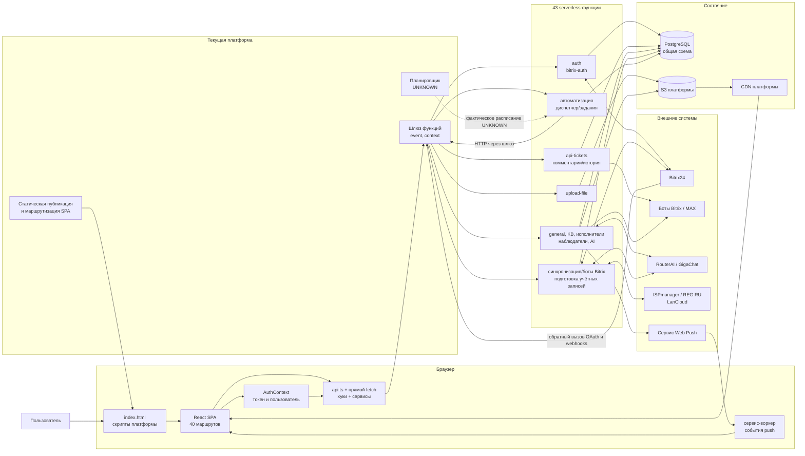

**Проверка по коду.** Запуск браузера: <code>index.html:29-54</code>, <code>src/main.tsx:21-23</code>; корень SPA: <code>src/App.tsx:63-120</code>; реестр: <code>backend/func2url.json:2-44</code>; средства DB: <code>backend/shared_utils.py:12-52</code>; S3/CDN: <code>backend/upload-file/index.py:60-129</code>; диспетчер: <code>backend/automation-dispatcher/index.py:143-235</code>.

**Вывод.** <code>[CONFIRMED]</code> Функции раздельно публикуются, но образуют одну систему через общую DB, JWT и HTTP-адреса. <code>[UNKNOWN]</code> Статическая публикация, шлюз и планировщик показаны как граница платформы; их фактическая конфигурация рабочей среды в коммите отсутствует.

## B. Типичный API-запрос

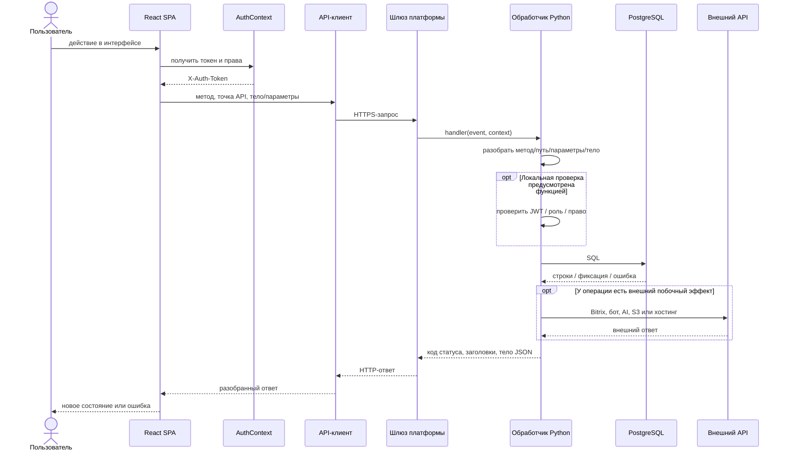

<code>[CONFIRMED]</code> Контракт <code>handler(event, context)</code> повторяется во всех 43 зарегистрированных функциях. Разбор события и проверка токена не централизованы: примеры <code>backend/auth/index.py:19-86</code>, <code>backend/api-tickets/index.py:1570-1604</code>, <code>backend/upload-file/index.py:69-92</code>.

<code>[INFERRED]</code> Шлюз может добавлять собственную защиту, CORS или преобразование события, но это нельзя подтвердить по репозиторию.

## B2. Фактическая граница ответственности frontend и backend

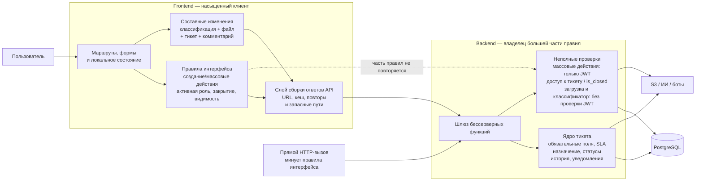

<code>[CONFIRMED]</code> Диаграмма показывает две разные роли frontend: обоснованную логику интерфейса и перегруженную сборку ответов API/составных изменений. Факты: топология API и повторы — <code>src/utils/api.ts:1-263</code>, <code>src/hooks/useTicketsData.ts:93-173</code>; создание тикета — <code>src/hooks/useTicketForm.ts:69-150</code>; запрет интерфейса для закрытой заявки — <code>src/pages/ticket-details/useTicketDetailsPage.ts:100-185</code>.

<code>[CONFIRMED]</code> Backend остаётся владельцем большей части ядра тикета (<code>backend/api-tickets/index.py:2330-3256</code>), но не все правила, выполняемые во frontend, закреплены на сервере: <code>POST tickets</code> и массовый API требуют только JWT (<code>backend/api-tickets/index.py:1805-1810</code>, <code>backend/api-tickets/index.py:2330-2619</code>, <code>backend/api-bulk-tickets/index.py:124-578</code>), общего запрета изменения закрытого тикета нет (<code>backend/api-tickets/index.py:2621-2681</code>, <code>backend/api-ticket-comments/index.py:521-547</code>), а <code>upload-file</code> и классификатор не проверяют JWT локально (<code>backend/upload-file/index.py:69-92</code>, <code>backend/api-classify-ticket/index.py:743-764</code>). Возможная защита шлюза остаётся <code>[UNKNOWN]</code>.

<code>[INFERRED]</code> Прямой HTTP-вызов минует все проверки интерфейса, поэтому frontend не может быть границей авторизации и целостности. Полная таблица разрывов и целевая граница описаны в [разделе 4.6 карты](./project-map.md#46-фактическая-граница-ответственности-frontend-и-backend).

## C. Граф зависимостей backend

```mermaid
flowchart TB
    Gateway["Шлюз функций"]

    subgraph Identity["Идентификация"]
        Auth["auth"]
        BitrixAuth["bitrix-auth"]
        General["api-general<br/>пользователи и справочники"]
    end

    subgraph TicketDomain["Ядро тикетов"]
        Tickets["api-tickets<br/>28 внутренних ветвей"]
        Comments["api-ticket-comments"]
        History["api-ticket-history"]
        Bulk["api-bulk-tickets"]
        Executors["группы исполнителей<br/>назначения, графики"]
        Watchers["api-watcher-rules"]
        Reassign["перераспределение<br/>по графику"]
        OtherMaintenance["автозакрытие<br/>проверка просрочки"]
    end

    subgraph Content["Контент"]
        Upload["upload-file"]
        KB["api-knowledge-base"]
        AITrain["обучение AI"]
        Classifier["api-classify-ticket"]
        Improve["api-improve-comment"]
    end

    subgraph Integration["Интеграции и задания"]
        Automation["automation"]
        Dispatcher["automation-dispatcher"]
        Sync["функции синхронизации Bitrix"]
        Inactive["bitrix-inactive-users"]
        Provision["create-employee-account"]
        Notifiers["Копии уведомителей Bitrix/MAX"]
    end

    DB[("Общая схема PostgreSQL")]
    Store[("S3/CDN платформы")]
    Ext["Внешние API"]

    Gateway --> Auth
    Gateway --> BitrixAuth
    Gateway --> General
    Gateway --> Tickets
    Gateway --> Comments
    Gateway --> History
    Gateway --> Bulk
    Gateway --> Executors
    Gateway --> Watchers
    Gateway --> Reassign
    Gateway --> OtherMaintenance
    Gateway --> Upload
    Gateway --> KB
    Gateway --> AITrain
    Gateway --> Classifier
    Gateway --> Improve
    Gateway --> Automation
    Gateway --> Dispatcher
    Gateway --> Sync
    Gateway --> Inactive
    Gateway --> Provision

    Auth --> DB
    BitrixAuth --> DB
    General --> DB
    Tickets --> DB
    Comments --> DB
    History --> DB
    Bulk --> DB
    Executors --> DB
    Watchers --> DB
    Reassign --> DB
    OtherMaintenance --> DB
    KB --> DB
    AITrain --> DB
    Classifier --> DB
    Automation --> DB
    Dispatcher --> DB
    Sync --> DB
    Inactive --> DB
    Provision --> DB

    Tickets --> Executors
    Tickets --> Notifiers
    Comments --> Notifiers
    Watchers --> Notifiers
    AITrain -->|HTTP| Classifier
    Automation -->|HTTP| Sync
    Automation -->|HTTP| Inactive
    Automation -->|HTTP| Reassign
    Dispatcher -->|HTTP: синхронизация или перераспределение| Gateway

    Upload --> Store
    KB --> Store
    BitrixAuth --> Ext
    Classifier --> Ext
    Improve --> Ext
    Sync --> Ext
    Inactive --> Ext
    Provision --> Ext
    Notifiers --> Ext
```

**Проверка по коду.** Маршрутизация ядра тикетов: <code>backend/api-tickets/index.py:1606-1664</code>; комментарии: <code>backend/api-ticket-comments/index.py:178-223</code>; ручные вызовы автоматизации: <code>backend/automation/index.py:284-352</code>; вызовы диспетчера: <code>backend/automation-dispatcher/index.py:143-193</code>; обучение AI вызывает классификатор по URL: <code>backend/api-ai-training/index.py:89-129</code>.

**Вывод.** <code>[CONFIRMED]</code> PostgreSQL — наиболее центральный узел. <code>automation</code> вручную вызывает только перераспределение, синхронизацию должностей и обработку неактивных пользователей; автозакрытие и проверка просрочки опубликованы отдельно, а источник их запуска <code>[UNKNOWN]</code>.

## D. Аутентификация и авторизация

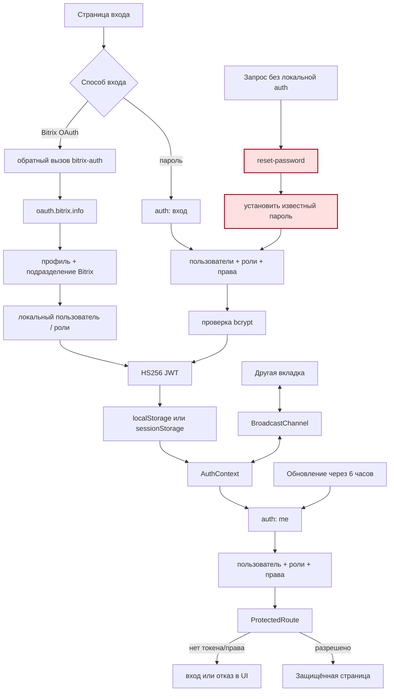

**Проверка по коду.** Пароль/JWT: <code>backend/auth/auth_service.py:16-141</code>, <code>backend/auth/jwt_service.py:11-35</code>; Bitrix: <code>backend/bitrix-auth/index.py:146-215</code>; сессия frontend: <code>src/contexts/AuthContext.tsx:60-115</code>, <code>src/contexts/AuthContext.tsx:157-235</code>, <code>src/contexts/AuthContext.tsx:254-347</code>; проверка маршрута: <code>src/components/ProtectedRoute.tsx:10-51</code>.

**Критический факт.** <code>[CONFIRMED]</code> Красная ветвь реализована в <code>backend/reset-password/index.py:12-65</code>: локальной проверки вызывающего нет, устанавливается и возвращается известный пароль. Диаграмма не утверждает, что шлюз платформы не защищает URL; правило шлюза <code>[UNKNOWN]</code>.

## E. Жизненный цикл тикета

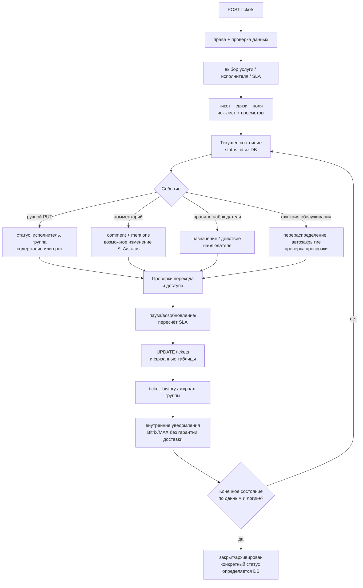

**Проверка по коду.** Create: <code>backend/api-tickets/index.py:2330-2619</code>; update: <code>backend/api-tickets/index.py:2621-3256</code>; comment: <code>backend/api-ticket-comments/index.py:506-711</code>; status dictionaries: <code>backend/api-tickets/index.py:3640</code>; maintenance entry points: <code>backend/reassign-by-schedule/index.py:30</code>, <code>backend/ticket-auto-close/index.py:15</code>, <code>backend/tickets-overdue-checker/index.py:15</code>.

**Вывод.** <code>[CONFIRMED]</code> Точные переходы нельзя честно изобразить фиксированным набором названий: часть поведения опирается на строки <code>ticket_statuses</code>, связи SLA и начальные данные рабочей среды. Поэтому диаграмма показывает механизм перехода, а не выдуманную конечную машину состояний.

## F. Карта интеграций

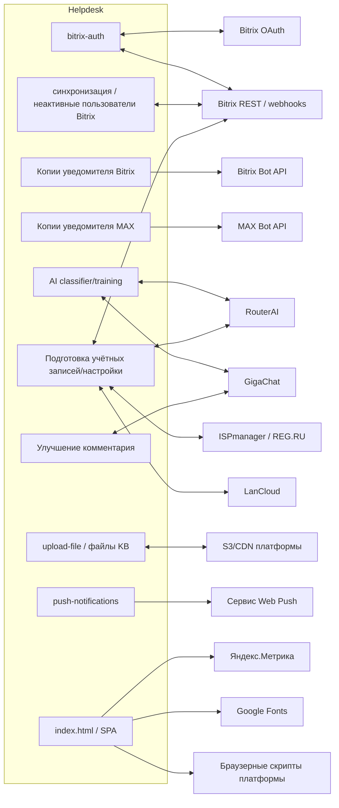

| Граница | Что пересекает её | Где подтверждено |
|---|---|---|
| Bitrix OAuth/REST | код авторизации, токен, профиль, подразделения, пользователи | <code>backend/bitrix-auth/index.py:146-215</code>, <code>backend/bitrix-sync-departments/index.py:563-650</code> |
| API ботов | получатели, текст тикета/комментария и ссылки | <code>backend/api-tickets/bitrix_bot_notifier.py:84-238</code>, <code>backend/api-tickets/max_bot_notifier.py:127-354</code> |
| AI | описания, справочники/обучающие данные и созданный результат | <code>backend/api-classify-ticket/index.py:743-874</code>, <code>backend/api-improve-comment/index.py:72-96</code> |
| Системы хостинга/учётных записей | контекст домена/учётной записи и учётные данные | <code>backend/create-employee-account/index.py:245-951</code> |
| S3/CDN | байты файла, ключ объекта и полный сохраняемый URL | <code>backend/upload-file/index.py:95-151</code>, <code>backend/api-knowledge-base/index.py:439-476</code> |
| Сторонние системы браузера | аналитика, запросы шрифтов и скрипты платформы | <code>index.html:16-39</code>, <code>index.html:56-97</code> |

<code>[CONFIRMED]</code> Интеграция Telegram в исследованном исходном коде не найдена. <code>[UNKNOWN]</code> Она может существовать вне коммита.

## G. Критические графы вызовов

### G1. Загрузка списка и начальных справочников

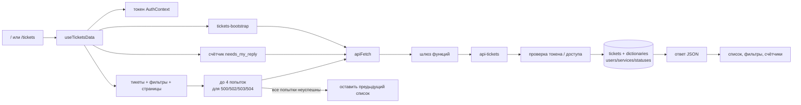

Проверено по <code>src/hooks/useTicketsData.ts:80-173</code>, <code>src/hooks/useTicketsData.ts:252-312</code>, <code>backend/api-tickets/index.py:4483-4629</code>. <code>[CONFIRMED]</code> При неуспехе список намеренно не очищается; это повышает устойчивость UI, но пользователь может видеть устаревшие данные.

### G2. Открытие полной карточки

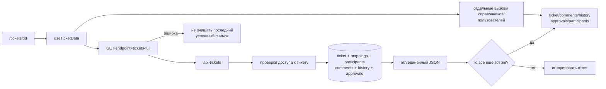

Проверено по <code>src/hooks/useTicketData.ts:68-145</code>, <code>backend/api-tickets/index.py:4632-4781</code>. <code>[CONFIRMED]</code> Комментарии берутся из объединённого ответа; отдельный запасной путь относится прежде всего к справочнику статусов, если основной ответ успешен, но пуст.

### G3. Создание тикета с AI и файлами

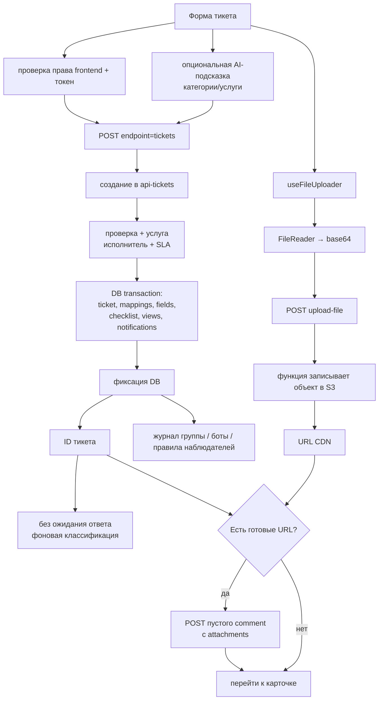

Проверено по <code>src/hooks/useTicketForm.ts:42-150</code>, <code>src/components/tickets/useTicketFormLogic.ts:64-167</code>, <code>src/hooks/useFileUploader.ts:26-99</code>, <code>backend/upload-file/index.py:132-164</code>, <code>backend/api-tickets/index.py:2330-2619</code>.

Ключевой вывод: <code>[CONFIRMED]</code> фиксация тикета, комментарий с вложениями, фоновая классификация, вызовы ботов и правила наблюдателей не являются одной сквозной транзакцией. Форма явно допускает результат «тикет создан, файлы не прикреплены».

### G4. Обновление, статус и назначение

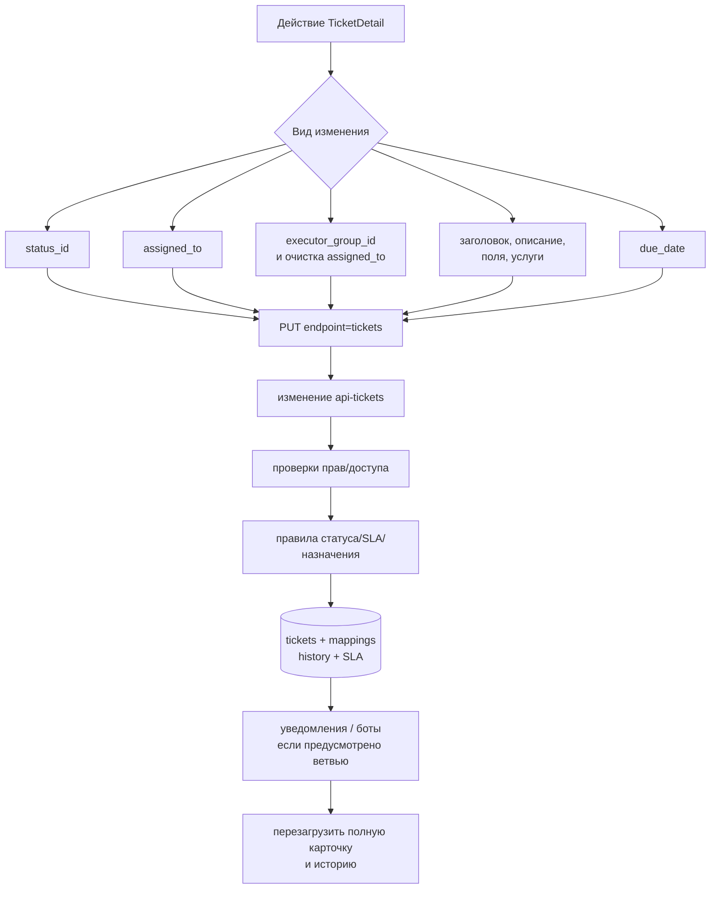

Проверено по <code>src/hooks/useTicketActions.ts:63-95</code>, <code>src/hooks/useTicketActions.ts:194-314</code>, <code>backend/api-tickets/index.py:2621-3256</code>. <code>[INFERRED]</code> Без версии/ETag в показанных данных frontend параллельные изменения могут перезаписывать друг друга; фактическая частота <code>[UNKNOWN]</code>.

### G5. Комментарий и уведомления

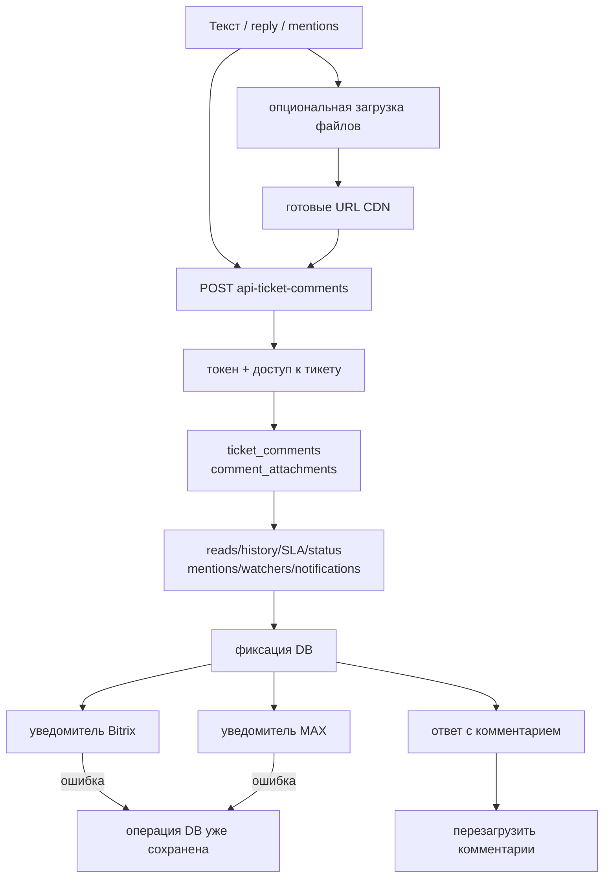

Проверено по <code>src/hooks/useTicketActions.ts:21-60</code>, <code>backend/api-ticket-comments/index.py:506-711</code>. <code>[CONFIRMED]</code> DB фиксируется до вызовов ботов (<code>backend/api-ticket-comments/index.py:667-708</code>), поэтому доставка уведомления не является частью атомарности комментария.

### G6. Автоматизация и отдельные фоновые функции

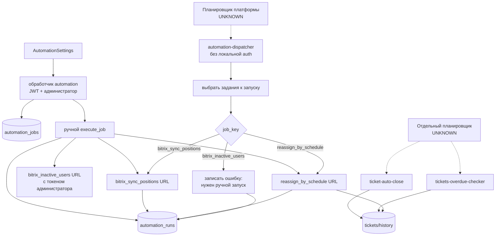

Проверено по <code>backend/automation/index.py:284-352</code>, <code>backend/automation/index.py:355-446</code>, <code>backend/automation-dispatcher/index.py:143-235</code>, <code>db_migrations/V0222__create_automation_jobs_and_runs.sql:1-49</code>.

<code>[CONFIRMED]</code> DB-диспетчер не вызывает автозакрытие и проверку просрочки. <code>[UNKNOWN]</code> Вызываются ли эти отдельные функции внешним планировщиком и вызывается ли сам диспетчер раз в минуту так, как обещает строка документации.

### G7. Подготовка учётных записей и настройки интеграций

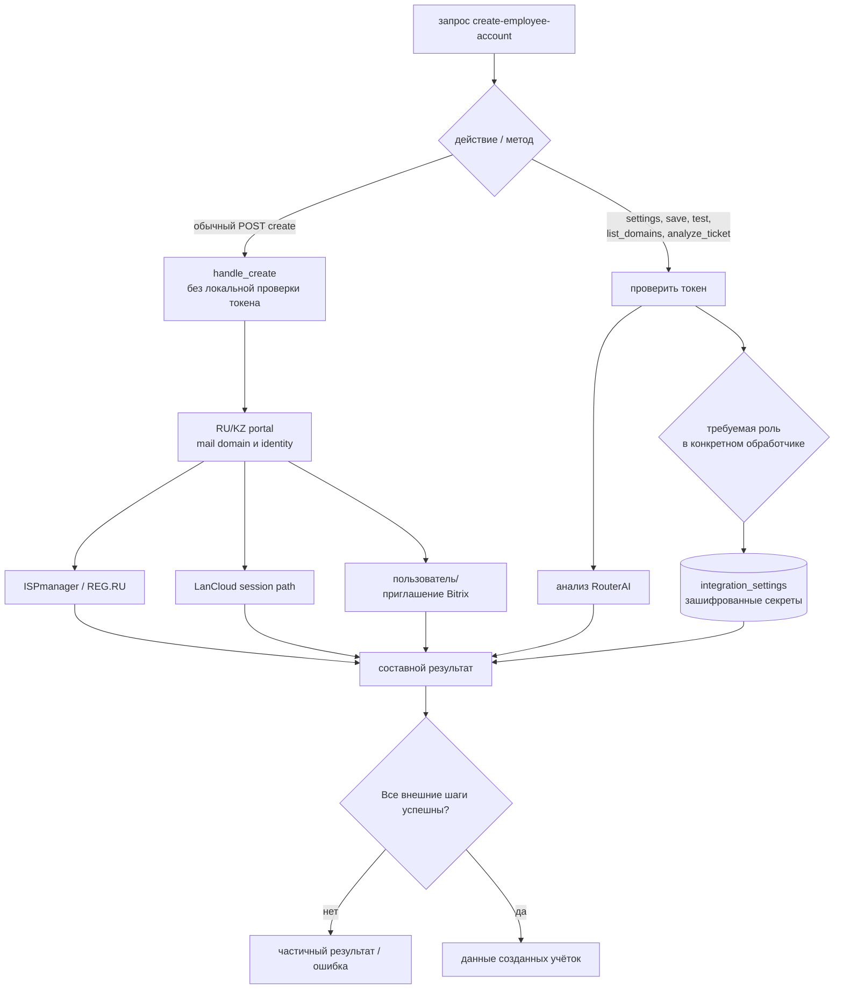

Проверено по <code>backend/create-employee-account/index.py:245-382</code>, <code>backend/create-employee-account/index.py:816-951</code>, <code>backend/create-employee-account/index.py:1537-1602</code>. <code>[CONFIRMED]</code> Ветка обычного создания в корневом обработчике уходит в <code>handle_create(body)</code> без предшествующего <code>verify_token</code>. Возможная защита на уровне шлюза <code>[UNKNOWN]</code>.

### G8. База знаний и файлы тикета

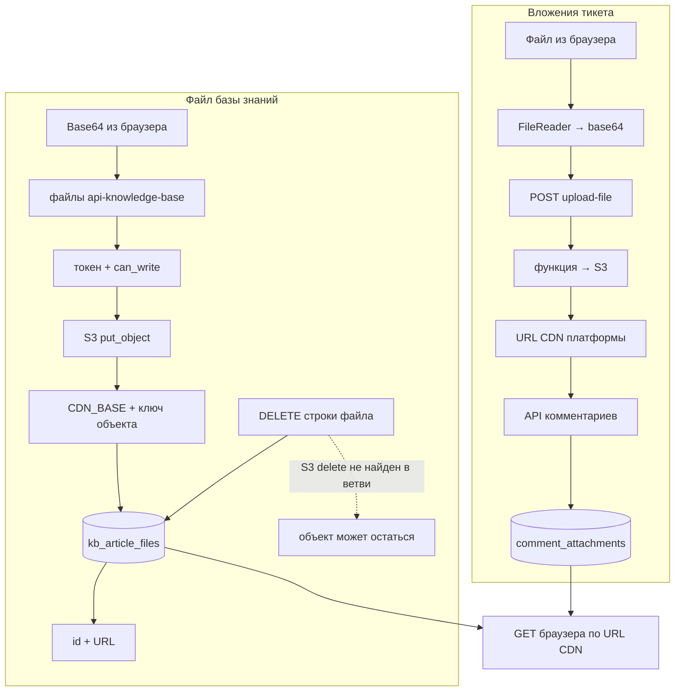

Проверено по <code>src/hooks/useFileUploader.ts:26-99</code>, <code>backend/upload-file/index.py:69-164</code>, <code>backend/api-ticket-comments/index.py:551-566</code>, <code>backend/api-knowledge-base/index.py:439-485</code>.

<code>[CONFIRMED]</code> Активный загрузчик тикетов и KB передают base64 через функции. Универсальная точка API дополнительно умеет выдать подписанный URL для PUT (<code>backend/upload-file/index.py:95-129</code>), но его использование во frontend не найдено. KB DELETE удаляет строку DB; вызова удаления объекта S3 в этой ветви нет.

## H. Логическая карта DB

Это сокращённая карта доменных связей, а не полный DDL всех 265 миграций.

```mermaid
erDiagram
    USERS ||--o{ USER_ROLES : имеет
    ROLES ||--o{ USER_ROLES : назначена
    ROLES ||--o{ ROLE_PERMISSIONS : выдаёт
    PERMISSIONS ||--o{ ROLE_PERMISSIONS : включено

    USERS ||--o{ TICKETS : создаёт_или_ведёт
    TICKET_STATUSES ||--o{ TICKETS : классифицирует
    TICKET_PRIORITIES ||--o{ TICKETS : задаёт_важность
    TICKET_CATEGORIES ||--o{ TICKETS : задаёт_категорию

    TICKETS ||--o{ TICKET_COMMENTS : содержит
    TICKET_COMMENTS ||--o{ COMMENT_ATTACHMENTS : имеет
    TICKETS ||--o{ TICKET_HISTORY : записывает
    TICKETS ||--o{ TICKET_WATCHERS : наблюдается
    TICKETS ||--o{ TICKET_VIEWS : просматривается
    TICKETS ||--o{ NOTIFICATIONS : вызывает

    TICKETS ||--o{ TICKET_TO_SERVICE_MAPPINGS : связывает
    TICKET_SERVICES ||--o{ TICKET_TO_SERVICE_MAPPINGS : выбрана
    TICKETS ||--o{ TICKET_CUSTOM_FIELD_VALUES : имеет
    TICKET_CUSTOM_FIELDS ||--o{ TICKET_CUSTOM_FIELD_VALUES : определяет

    EXECUTOR_GROUPS ||--o{ EXECUTOR_GROUP_MEMBERS : содержит
    USERS ||--o{ EXECUTOR_GROUP_MEMBERS : участвует
    EXECUTOR_GROUPS ||--o{ EXECUTOR_GROUP_SERVICE_MAPPINGS : обслуживает
    TICKET_SERVICES ||--o{ EXECUTOR_GROUP_SERVICE_MAPPINGS : сопоставлена

    KB_CATEGORIES ||--o{ KB_ARTICLES : группирует
    KB_ARTICLES ||--o{ KB_ARTICLE_FILES : имеет
    KB_ARTICLES ||--o{ KB_ARTICLE_COMMENTS : обсуждается
    KB_ARTICLES ||--o{ KB_ARTICLE_TAGS : помечается
    KB_TAGS ||--o{ KB_ARTICLE_TAGS : обозначает
    KB_ARTICLES ||--o{ KB_ARTICLE_TICKETS : связано
    TICKETS ||--o{ KB_ARTICLE_TICKETS : ссылается

    AUTOMATION_JOBS ||--o{ AUTOMATION_RUNS : создаёт
```

**Проверка по миграциям.** RBAC: <code>db_migrations/V0059__create_auth_system.sql:1-61</code>; тикеты/комментарии/дополнительные поля: <code>db_migrations/V0060__create_tickets_system.sql:1-80</code>; услуги: <code>db_migrations/V0064__create_services_tables.sql:1-35</code>; группы исполнителей: <code>db_migrations/V0112__create_executor_groups_tables.sql:1-32</code>; KB: <code>db_migrations/V0206__knowledge_base_foundation.sql:3-100</code>; автоматизация: <code>db_migrations/V0222__create_automation_jobs_and_runs.sql:1-49</code>.

<code>[CONFIRMED]</code> Связи упрощены до главных сущностей. Например, tickets имеет несколько ролей пользователя, SLA и согласования/наблюдатели добавлены поздними миграциями, а часть ранних таблиц переопределялась последующими файлами. Фактически применённый DDL рабочей среды <code>[UNKNOWN]</code>.

## Проверка самих диаграмм

Диаграммы сверены с:

- 40 маршрутами <code>src/App.tsx:74-113</code>;
- 43 записями реестра <code>backend/func2url.json:2-44</code>;
- 28 ветвями <code>api-tickets</code> в <code>backend/api-tickets/index.py:1606-1664</code>;
- хуками frontend основных потоков;
- корневыми <code>handler(event, context)</code> и прямыми межфункциональными вызовами;
- ключевыми миграциями и таблицами.

Ограничения:

1. Даже корректный синтаксис Mermaid не подтверждает связь среды исполнения; источником истины остаются указанные строки кода.
2. Стрелка к DB означает фактический доступ SQL, а не отдельную границу репозитория/сервиса.
3. Пунктирные рёбра планировщика/шлюза намеренно имеют статус <code>[UNKNOWN]</code>.
4. Вызовы ботов и часть внешних действий выполняются после фиксации DB; стрелки не означают общую транзакцию.
5. Диаграмма жизненного цикла не фиксирует названия/ID статусов без проверки начальных данных рабочей среды.
